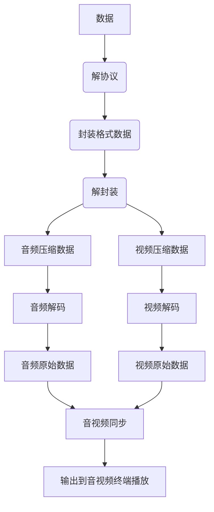

[toc]

# 生活中的音视频技术

电影文件有不同的格式，用不同的后缀表示：avi，rmvb，mp4，flv，mkv等等。
这些格式代表的是封装格式。何为封装格式？就是把视频数据和音频数据打包成一个文件的规范。总的来说，不同的封装格式之间差距不大，各有优劣。

注：有些封装格式支持的视音频编码标准十分广泛，应该算比较优秀的封装格式，比如MKV；而有些封装格式支持的视音频编码标准很少，应该属于落后的封装格式，比如RMVB。

## MediaInfo
MediaInfo是一个专门查看视音频格式的工具，软件的详细使用可参考：

[MediaInfo使用简介（新版本支持HEVC）](http://blog.csdn.net/leixiaohua1020/article/details/11903507)

源代码分析可参考：

[MediaInfo源代码分析 1：整体结构系列文章](http://blog.csdn.net/leixiaohua1020/article/details/12016231)  

视音频技术主要包含以下几点：封装技术，视频压缩编码技术以及音频压缩编码技术。如果考虑到网络传输的话，还包括流媒体协议技术。

# I帧/P帧/B帧
视频压缩中，每帧代表一幅静止的图像。而在实际压缩时，会采取各种算法减少数据的容量，其中IPB就是最常见的。

I帧是关键帧，属于帧内压缩。就是和AVI的压缩是一样的。 P是向前搜索的意思。B是双向搜索。他们都是基于I帧来压缩数据。 

I帧表示关键帧，你可以理解为这一帧画面的完整保留；解码时只需要本帧数据就可以完成（因为包含完整画面）

P帧表示的是这一帧跟之前的一个关键帧（或P帧）的差别，解码时需要用之前缓存的画面叠加上本帧定义的差别，生成最终画面。（也就是差别帧，P帧没有完整画面数据，只有与前一帧的画面差别的数据）

B帧是双向差别帧，也就是B帧记录的是本帧与前后帧的差别（具体比较复杂，有4种情况），换言之，要解码B帧，不仅要取得之前的缓存画面，还要解码之后的画面，通过前后画面的与本帧数据的叠加取得最终的画面。B帧压缩率高，但是解码时CPU会比较累。

I和P的解码算法比较简单，资源占用也比较少，I只要自己完成就行了，P也只需要解码器把前一个画面缓存一下，遇到P时就使用之前缓存的画面就好了，如果视频流只有I和P，解码器可以不管后面的数据，边读边解码，线性前进，大家很舒服。

预读预解码
网络上的电影很多都采用了B帧，因为B帧记录的是前后帧的差别，比P帧能节约更多的空间，这样一来，文件小了，解码器就麻烦了，因为在解码时，不仅要用之前缓存的画面，还要知道下一个I或者P的画面（也就是说要预读预解码），而且，B帧不能简单地丢掉，因为B帧其实也包含了画面信息，如果简单丢掉，并用之前的画面简单重复，就会造成画面卡（其实就是丢帧了），并且由于网络上的电影为了节约空间，往往使用相当多的B帧，B帧用的多，对不支持B帧的播放器就造成更大的困扰，画面也就越卡。 

一般平均来说，I的压缩率是7（跟JPG差不多），P是20，B可以达到50，可见使用B帧能节省大量空间，节省出来的空间可以用来保存多一些I帧，这样在相同码率下，可以提供更好的画质。

# 数据-采集从哪里来
## 采样原理

**定义**：对连续变化图像在空间坐标上做离散化处理，将模拟信号转变成数字信号的过程，即为图像进行采样。
**通俗来说**：采集就是将看到的东西转成二进制流的过程。

## 基础概念
### 图像

「图像」是个集合的概念，帧、顶场、底场都可以称为图像。

- 帧
一帧通常是一幅完整图像，当采用逐行扫描方式扫描，每次扫描得到的信号就是一帧。

- 顶场与底场
采集视频信号时，扫描方式分为逐行扫描与隔行扫描。如果采用逐行扫描，得到的则是一幅完整的图像；而采用隔行扫描（奇、偶数行），则扫描下来的一帧图像就被分为了两个部分，这每一部分就称为「场」，根据次序分为：「顶场」和「底场」

- 隔行扫描
每一帧被分割为两场画面交替显示。每一帧被分割为顶场与底场，通常是先扫描奇数行得到第一场，然后扫描偶数行得到第二场。由于视觉暂留效应，人眼将会看到平滑的运动而不是闪动的半帧半帧的图像。但是这时会有闪烁出现，尽管不容易被察觉，但会使得人眼容易疲劳。当屏幕的内容是横条纹时，这种闪烁特别容易被注意到，并且会有锯齿瑕疵。

- 逐行扫描
则是将每帧的所有画面同时显示。每次都显示整个扫描帧，如果逐行扫描的帧率和隔行扫描的场率相同，人眼将看到比隔行扫描更平滑的图像，相对于隔行扫描来说闪烁较小。每一帧图像均是由电子束顺序地一行接着一行连续扫描而成，这种扫描方式称为逐行扫描。

- 两者区别
  举个栗子，25fps 100行帧图像，那么隔行扫描需要一秒扫描50次，但每次只需要扫描50行。而逐行扫描则只需要扫描25次，但每次需要扫描100行。 结论：隔行扫描扫描频率为逐行扫描双倍，信道带宽为逐行扫描的一半。在图像体验降低不多的情况下，信道带宽减少了一半，使得设备成本减少，因此，早期大多数显示器都采用隔行扫描。每秒传输帧数(Frames Per Second)，也可理解为刷新率（单位为Hz），一般我们设置缺省刷新率都在75Hz（即75帧/秒）以上。例如：75Hz的刷新率刷也就是指屏幕一秒内只扫描75次，即75帧/秒。而当刷新率太低时我们肉眼都能感觉到屏幕的闪烁，不连贯，对图像显示效果和视觉感观产生不好的影响。

  **电影：**24fps

  **电视（PAL）：**25fps

  **电视（NTSC）：**30fps

  **CRT显示器：**75Hz以上

  **液晶显示器：**一般为60Hz

  当画面的分辨率是1024×768时，画面的刷新率要达到24帧/秒，那么显卡在一秒钟内需要处理的像素量就达到了“1024×768×24=18874368”。处理能力=分辨率×刷新率。这也就是为什么在玩游戏时，分辨率设置得越大，画面就越不流畅的原因了。

  分辨率建议设置为显示器分辨率，过高或过低可能造成画面变形。

  采用70Hz以上的刷新频率时才能基本消除闪烁，显示器最好稳定工作在允许的最高频率下，一般是85Hz。

  人们通常所说的刷新频率，指的就是振荡电路的频率。

  刷新频率的计算公式是：水平同步扫描线X帧频=刷新频率。

  普通显示器的刷新频率在15.75kHz－95kHz间。

  15.75kHz是人体对显示器最低要求的刷新频率，是由525（线）X30（fps）=15.75kHz计算所得。

  由此，我们可以逆推出显示器扫描一条水平线的周期：众所周知，周期和频率是倒数关系，即1/频率=周期。

  在这里，1/15.75kHz= 63.5us（微秒），也就是说在每帧525线、每秒30帧的模式下，显示器扫描一条水平线的周期是63.5微秒。

  维基百科上面码流和码率的定义：

  多媒体行业在指音频或者视频在单位时间内的数据传输率时通常使用**码流**或**码率**，单位是kbps（千位每秒）。码流也就是比特率。就是单位时间内通过的码字。

  分辨率：就是一张图片有多少个像素点。比如说1080p的分辨率就是有1920×1080个像素点。

  > 影响清晰度跟分辨率有关系，分辨率越大，码流就越大。

  清晰度肯定是跟分辨率有关系，分辨率越大，看起来越清晰， 跟码流没有关系。码流是跟视频或者图片的压缩程度有关系。

  帧率越高，视频越流畅。帧率是我们说的刷新率。

  

- 传送门：[逐行扫描、隔行扫描详细讲解](http://cache.baiducontent.com/c?m=9f65cb4a8c8507ed4fece7631046893b4c4380143fd3d1027fa3c215cc79051a003fb0e772351770d1c37e6116a94b5feaf42b22695e75aada8edb0c86ea8f2f288c2d347716854110d019a9c84126c227945de8aa1ae0a7e477ceee84dcc82459dd27036d81809c2c0203bc6de71541f4d7925f665507cbec2712f54e775888524ba136faf7431e10f1fc&p=c23fce16d9c15de00fbd9b7d0d1091&newp=8b2a971d92d505ee02bd9b7d0d1081231610db2151d7d601298ffe0cc4241a1a1a3aecbf27281706d5c37a6d02a94a56e0f73074350034f1f689df08d2ecce7e77cc31703146&user=baidu&fm=sc&query=%25B8%25F4%25D0%25D0%25C9%25A8%25C3%25E8+%25C9%25C1%25CB%25B8&qid=c355ac760035ba58&p1=3)

### 颜色模型

#### RGB颜色模型

RGB分别代表红绿蓝，每种颜色需要用3个数字表示，一个数字占用1字节，一种颜色则需要3字节，24位。

更高效的颜色模型？YUV

#### YCbCr颜色模型

YCbCr颜色模型是YUV家族的一员，关键特点在于它亮度信号Y与色度信号U、V相互分离。当缺失U、V，仅有Y信号时，也能够表示出黑白图像。

> Y = kr\*R + kg\*G + kb\*B

Y 即「亮度」，kr、kg、kb 即 R、G、B 的权重值。
> Cr = R – Y; Cg = G – Y; Cb = B – Y;

疑问：对比RGB模型，YCbCr模型每个像素也需要3个信号表示，为什么说该模型更高效？

人眼对亮度分辨率敏感度高于色彩敏感度。

基于人眼视觉特性，很明显，我们需要从颜色方面入手，于是提出“色度取样”，使颜色存储减半或者更多。容易实现，编码压力较小，收益较高。

显示器扫描原理分为逐行扫描与隔行扫描，每条扫描线被扫描时，色度数值传送频率会比亮度低，颜色取样方式有多种，取样方式通常基于亮度值，以4:X:Y的形式描述，X和Y是每两个色度通道中的数值的相对数量：

这样一幅图片，上面有像素阵列：
原始像素阵列

YCbCr 4:4:4

会有以下几种采样优化方式：
4:2:2优化后像素阵列

4:2:2取样方式

4:2:0优化后像素阵列

4:2:0取样方式

上图可以很直观的看出：采用YCbCr颜色模型后，并不需要每个像素都存有3个分量，颜色分量通过“色度取样”后，有效的减少了颜色分量的存储。

## 图像感知与获取

- 通过电功率和对特殊类型检测能源敏感的传感器材料组合。
- 将输入的光照能量变为特殊的电压波形。
- 波形的幅度和空间特性都与感知的物理现象有关。为了产生数字图像，接下来需要进行取样与量化处理。

## 采样与量化

对于黑白图像图(a)为连续图像，如果需要转换成数字形式，需要几步主要操作：

# 渲染-数据如何展现
## 播放器原理

视频播放器的源代码详细解析（Media Player Classic - HC，Mplayer，FFplay，XBMC）可以参考系列文章：

- [Media Player Classic：Media Player Classic - HC源代码分析 1：整体结构系列文章](http://blog.csdn.net/leixiaohua1020/article/details/13280659)

- [Mplayer：MPlayer源代码分析](http://blog.csdn.net/leixiaohua1020/article/details/11885509)

- [FFplay： FFplay源代码分析：整体流程图](http://blog.csdn.net/leixiaohua1020/article/details/11980843)

- [XBMC： XBMC源代码分析 1：整体结构以及编译方法系列文章](http://blog.csdn.net/leixiaohua1020/article/details/17454977) 

播放器播放从互联网上播放视频，需要经过：解协议、解封装、解码、音视频同步这几个核心步骤。

1. **解协议**：将流媒体协议数据，解析为标准封装格式数据。视音频在网络上传播的时候，常常采用各种流媒体协议，例如HTTP，RTMP，或是MMS等等。这些协议在传输视音频数据的同时，也会传输一些信令数据。这些信令数据包括对播放的控制（播放，暂停，停止），或者对网络状态的描述等。解协议的过程中会去除掉信令数据而只保留视音频数据。例如，采用RTMP协议传输的数据，经过解协议操作后，输出FLV格式的数据。
2. **解封装**：将解协议得到的标准封装格式数据，分离为音频流压缩编码数据与视频流压缩编码数据。封装格式也称为容器，即是将已经编码压缩好的视频轨与音频轨按照一定格式放到一个文件中。 需要注意的是：就算是同一个封装格式，其编码方式并不一定一样，我们可以从后缀名中直观的看到视频文件到封装格式。常见封装格式：avi，rmvb，mp4，flv，mkv，TS等。例如，FLV格式的数据，经过解封装操作后，输出H.264编码的视频码流和AAC编码的音频码流。
3. **解码**：就是将音视频压缩编码数据，解码成为非压缩的音视频原始数据。音频编码标准有AAC，MP3，AC-3等；视频编码标准包含H.264，MPEG2，VC-1等。编解码是整个流程最核心与最复杂的环节。通过解码，压缩编码的视频数据输出成为非压缩的颜色数据，例如YUV420P，RGB等等；压缩编码的音频数据输出成为非压缩的音频抽样数据，例如PCM数据。
4. **音视频同步**：根据解封装过程获取的参数信息，将解码出来的音视频数据进行同步对其，最终将数据传送到系统，由系统调用硬件显卡和声卡进行播放。

## 视频编码方式

视频编解码过程是数字视频压缩与解压缩的过程。

视频编解码的作用就是：在设备的摄像头采集画面和前处理后，将图像进行压缩、进行数字编码、用于传输。

编解码器的优劣基本在于：压缩效率的高低、速度和功耗。

选取音视频编码方案时，需要考虑：视频的质量、码率、编码算法和解码算法的复杂度、针对数据丢失和错误的鲁棒性（Robustness）、编辑的方便性、随机访问、编码算法设计的完美性、端到端的延时以及其它一些因素。

目前，主流的视频编码器分为3个系列：
- 1）VPx（VP8，VP9）：
VPx系列是由Google开源的视频编解码标准。在保证相同质量情况下，VP9相比VP8码率减少约50%；
- 2）H.26x（H.264，H.265）：
H.26x系列在硬件支持上比较广泛，H.265的编码效率能比上一代提高了30-50%，但是复杂度和功耗会比上一代大很多，所以纯软件编码实现的话有一定瓶颈，现有的技术下，还是需要依靠硬件编解码为主；
- 3）AVS（AVS1.0，AVS2.0）：
AVS是我国具备自主知识产权的第二代信源编码标准，目前已经发展到第二代。

### H.26X系列

H.26X 系列，由国际电传视讯联盟远程通信标准化组织(ITU-T)主导，包括 H.261、H.262、H.263、H.264、H.265。

- H.261，主要用于老的视频会议和视频电话系统。是第一个使用的数字视频压缩标准。实质上说，之后的所有的标准视频编解码器都是基于它设计的。
- H.262，等同于 MPEG-2 第二部分，使用在 DVD、SVCD 和大多数数字视频广播系统和有线分布系统中。

- H.263，主要用于视频会议、视频电话和网络视频相关产品。在对逐行扫描的视频源进行压缩的方面，H.263 比它之前的视频编码标准在性能上有了较大的提升。尤其是在低码率端，它可以在保证一定质量的前提下大大的节约码率。

- H.264，等同于 MPEG-4 第十部分，也被称为高级视频编码(Advanced Video Coding，简称 AVC)，是一种视频压缩标准，一种被广泛使用的高精度视频的录制、压缩和发布格式。该标准引入了一系列新的能够大大提高压缩性能的技术，并能够同时在高码率端和低码率端大大超越以前的诸标准。

- H.265，被称为高效率视频编码(High Efficiency Video Coding，简称 HEVC)是一种视频压缩标准，是 H.264 的继任者。HEVC 被认为不仅提升图像质量，同时也能达到 H.264 两倍的压缩率（等同于同样画面质量下比特率减少了 50%），可支持 4K 分辨率甚至到超高画质电视，最高分辨率可达到 8192×4320（8K 分辨率），这是目前发展的趋势。
- webRTC
首先会用到的肯定是WebRTC，是一个支持网页浏览器进行实时语音对话或视频对话的开源项目。它提供了包括音视频的采集、编解码、网络传输、显示等功能。如果你想基于WebRTC开发实时音视频应用，需要注意，由于WebRTC缺少服务端设计和部署方案，你还需要将WebRTC与Janus等服务端类开源项目结合即可。

### MPEG系列

MPEG 系列，由国际标准组织机构(ISO)下属的运动图象专家组(MPEG)开发。
- MPEG-1 第二部分，主要使用在 VCD 上，有些在线视频也使用这种格式。该编解码器的质量大致上和原有的 VHS 录像带相当。

- MPEG-2 第二部分，等同于 H.262，使用在 DVD、SVCD 和大多数数字视频广播系统和有线分布系统中。

- MPEG-4 第二部分，可以使用在网络传输、广播和媒体存储上。比起 MPEG-2 第二部分和第一版的 H.263，它的压缩性能有所提高。

- MPEG-4 第十部分，等同于 H.264，是这两个编码组织合作诞生的标准。

## 音频编解码方式

音频常用编码格式

- AAC，英文全称 Advanced Audio Coding，是由 Fraunhofer IIS、杜比实验室、AT&T、Sony等公司共同开发，在 1997 年推出的基于 MPEG-2 的音频编码技术。2000 年，MPEG-4 标准出现后，AAC 重新集成了其特性，加入了 SBR 技术和 PS 技术，为了区别于传统的 MPEG-2 AAC 又称为 MPEG-4 AAC。

- MP3，英文全称 MPEG-1 or MPEG-2 Audio Layer III，是曾经非常流行的一种数字音频编码和有损压缩格式，它被设计来大幅降低音频数据量。它是在 1991 年，由位于德国埃尔朗根的研究组织 Fraunhofer-Gesellschaft 的一组工程师发明和标准化的。MP3 的普及，曾对音乐产业造成极大的冲击与影响。
- WMA，英文全称 Windows Media Audio，由微软公司开发的一种数字音频压缩格式，本身包括有损和无损压缩格式。

# 处理-数据加工

音视频加工处理，是业务的核心需求，对开发者自由度最大的一个环节，通过音视频处理，可以实现各种各样炫酷的特效。

**图像、视频常见处理方式**：美化、裁剪、缩放、旋转、叠加、编解码等。
**音频常见处理方式**：重采样、去噪，回声消除，混音、编解码等

常见框架：
1. 图像处理：OpenGL，OpenCV，libyuv，ffmpeg 等；
2. 视频编解码：x264，OpenH264，ffmpeg 等；
3. 音频处理：speexdsp，ffmpeg 等；
4. 音频编解码：libfaac，opus，speex，ffmpeg 等。

（传送门：[音视频开发开源码工程汇总](http://www.52im.net/thread-1395-1-1.html)）

# 传输-数据如何传输
## 流媒体协议

流媒体，指通过互联网以流式传输方式的媒体。流媒体协议，则是服务器与客户端之间通信遵循但规定。说到音视频传输，我们不得不提流媒体协议，常见流媒体协议有：

| 协议  | 概述                                                         | 特点                                                         | 应用场景                                                     |
| :---- | :----------------------------------------------------------- | :----------------------------------------------------------- | :----------------------------------------------------------- |
| RTP   | （Real-time Transport Protocol）一种网络传输协议，RTP协议详细说明了在互联网上传递音频和视频的标准数据包格式。 | 基于UDP 协议实现                                             | RTP协议常用于流媒体系统（配合 RTSP 协议）                    |
| RTCP  | （Real-time Transport Control Protoco）实时传输协议（RTP）的一个姐妹协议。 | RTCP为RTP媒体流提供信道外（out-of-band）控制。RTCP 本身并不传输数据，但和 RTP 一起协作将多媒体数据打包和发送。RTCP 定期在流多媒体会话参加者之间传输控制数据。 | 为 RTP 所提供的服务质量（Quality of Service）提供反馈。      |
| RTSP  | （Real Time Streaming Protocol）定义了一对多应用程序如何有效地通过 IP 网络传送多媒体数据。 | RTSP 在体系结构上位于 RTP 和 RTCP 之上，使用 TCP 或 UDP 完成数据传输 | 使用 RTSP 时，客户机和服务器都可以发出请求，即 RTSP 可以是双向的。 |
| RTMP  | （Real Time Messaging Protocol）Adobe Systems 公司为 Flash 播放器和服务器之间音频、视频和数据传输开发的开放协议。 | 协议基于 TCP，是一个协议族，包括 RTMP 基本协议及 RTMPT/RTMPS/RTMPE 等多种变种。 | 一种设计用来进行实时数据通信的网络协议，主要用来在 Flash/AIR 平台和支持RTMP协议的流媒体/交互服务器之间进行音视频和数据通信。 |
| RTMFP | （Real Time Media Flow0 Protoco）Adobe 公司开发的一套新的通信协议，全称 Real Time Media Flow Protocol | 协议基于 UDP，支持 C/S 模式和 P2P 模式，即该协议可以让使用 Adobe Flash Player 的终端用户之间进行直接通信 | Adobe Flash Player 的终端用户之间进行直接通信                |
| HTTP  | （HyperText Transfer Protoco）运行在 TCP 之上                |                                                              | 这个协议是大家非常熟悉的，它也可以用到视频业务中来。         |
| HLS   | （HTTP Live Streaming）是苹果公司实现的基于 HTTP 的流媒体传输协议，全称 ，可支持流媒体的直播和点播 | 短时长的媒体文件（MPEG-TS 格式），客户端不断的下载并播放这些小文件。由于数据通过 HTTP 协议传输，所以完全不用考虑防火墙或者代理的问题，而且分段文件的时长很短，客户端可以很快的选择和切换码率，以适应不同带宽条件下的播放 HLS 的这种技术特点，决定了它的延迟一般总是会高于普通的流媒体直播协议 | 主要应用在 iOS 系统，为 iOS 设备（如 iPhone、iPad）提供音视频直播和点播方案。 |

## 网络[视频点播](https://cloud.tencent.com/product/vod?from=10680)业务

| 公司         | 协议 | 封装 | 视频编码 | 音频编码 | 播放器 |
| :----------- | :--- | :--- | :------- | :------- | :----- |
| CNTV         | HTTP | MP4  | H.264    | AAC      | Flash  |
| CNTV（部分） | RTMP | FLV  | H.264    | AAC      | Flash  |
| 华数 TV      | HTTP | MP4  | H.264    | AAC      | Flash  |
| 优酷网       | HTTP | FLV  | H.264    | AAC      | Flash  |
| 土豆网       | HTTP | F4V  | H.264    | AAC      | Flash  |
| 56网         | HTTP | FLV  | H.264    | AAC      | Flash  |
| 音悦台       | HTTP | MP4  | H.264    | AAC      | Flash  |
| 乐视网       | HTTP | FLV  | H.264    | AAC      | Flash  |
| 新浪视频     | HTTP | FLV  | H.264    | AAC      | Flash  |

网络视频点播业务采用 HTTP 有两方面优势：
- HTTP 是基于 TCP 协议的应用层协议，媒体传输过程中不会出现丢包等现象，从而保证了视频的质量。
- HTTP 是绝大部分的 Web 服务器支持的协议，因而流媒体服务机构不必投资购买额外的流媒体服务器，从而节约了开支。

对于封装格式：MP4，FLV，F4V 几者只是容器，带来的差异不大，而关键的是音视频解码方式：H.264与AAC，这两种编码标准目前仍被最广泛的应用。

## 网络视频直播业务

| 公司             | 协议     | 封装 | 视频编码 | 音频编码 | 播放器 |
| :--------------- | :------- | :--- | :------- | :------- | :----- |
| 华数TV           | RTMP     | FLV  | H.264    | AAC      | Flash  |
| 六间房           | RTMP     | FLV  | H.264    | AAC      | Flash  |
| 中国教育电视台   | RTMP     | FLV  | H.264    | AAC      | Flash  |
| 北广传媒移动电视 | RTMP     | FLV  | H.264    | AAC      | Flash  |
| 上海IPTV         | RTSP+RTP | TS   | H.264    | MP2      | 机顶盒 |

网络视频直播服务采用 RTMP 作为直播协议的好处是可以直接被 Flash 播放器支持，而 Flash 播放器在 PC 时代有着极高的普及率，并且与浏览器结合的很好。因此这种流媒体直播平台基本上可以实现了「无插件直播」，极大降低了用户使用成本。

封装格式、视频编码、音频编码、播放器方面几乎全部采用了 FLV、H.264、AAC、Flash。FLV、RTMP、Flash 都是 Adobe 公司的产品，天生有着良好的结合性。

# 流媒体协议，封装格式及视音频编码标准
## 1.比较

更详细的比较可以参考：

[视频参数（流媒体系统，封装格式，视频编码，音频编码，播放器）对比](http://blog.csdn.net/leixiaohua1020/article/details/11842919)

有关本文中涉及到的协议数据、封装格式数据、视频编码数据、音频编码数据、视频像素数据、音频采样数据的分析可以参考下面系列文章：

[视音频数据处理入门：RGB、YUV像素数据处理](http://blog.csdn.net/leixiaohua1020/article/details/50534150)

[视音频数据处理入门：PCM音频采样数据处理](http://blog.csdn.net/leixiaohua1020/article/details/50534316)

[视音频数据处理入门：H.264视频码流解析](http://blog.csdn.net/leixiaohua1020/article/details/50534369)

[视音频数据处理入门：AAC音频码流解析](http://blog.csdn.net/leixiaohua1020/article/details/50535042)

[视音频数据处理入门：FLV封装格式解析](http://blog.csdn.net/leixiaohua1020/article/details/50535082)

[视音频数据处理入门：UDP-RTP协议解析](http://blog.csdn.net/leixiaohua1020/article/details/50535230) 

## 2.   流媒体协议

流媒体协议是服务器与客户端之间通信遵循的规定。当前网络上主要的流媒体协议如表所示。

主要流媒体协议一览

| 名称     | 推出机构       | 传输层协议 | 客户端   | 目前使用领域    |
| -------- | -------------- | ---------- | -------- | --------------- |
| RTSP+RTP | IETF           | TCP+UDP    | VLC, WMP | IPTV            |
| RTMP     | Adobe Inc.     | TCP        | Flash    | 互联网直播      |
| RTMFP    | Adobe Inc.     | UDP        | Flash    | 互联网直播      |
| MMS      | Microsoft Inc. | TCP/UDP    | WMP      | 互联网直播+点播 |
| HTTP     | WWW+IETF       | TCP        | Flash    | 互联网点播      |

RTSP+RTP经常用于IPTV领域。因为其采用UDP传输视音频，支持组播，效率较高。但其缺点是网络不好的情况下可能会丢包，影响视频观看质量。因而围绕IPTV的视频质量的研究还是挺多的。

RTSP规范可参考：[RTSP协议学习笔记](http://blog.csdn.net/leixiaohua1020/article/details/11955341)

RTSP+RTP系统中衡量服务质量可参考：[网络视频传输的服务质量（QoS）](http://blog.csdn.net/leixiaohua1020/article/details/11883393)

上海IPTV码流分析结果可参考：[IPTV视频码流分析](http://blog.csdn.net/leixiaohua1020/article/details/11846761)

因为互联网网络环境的不稳定性，RTSP+RTP较少用于互联网视音频传输。互联网视频服务通常采用TCP作为其流媒体的传输层协议，因而像RTMP，MMS，HTTP这类的协议广泛用于互联网视音频服务之中。这类协议不会发生丢包，因而保证了视频的质量，但是传输的效率会相对低一些。

此外RTMFP是一种比较新的流媒体协议，特点是支持P2P。

RTMP我做的研究相对多一些：比如[RTMP规范简单分析](http://blog.csdn.net/leixiaohua1020/article/details/11694129)，或者[RTMP流媒体播放过程](http://blog.csdn.net/leixiaohua1020/article/details/11704355)

相关工具的源代码分析：[RTMPdump源代码分析 1： main()函数[系列文章\]](http://blog.csdn.net/leixiaohua1020/article/details/12952977)

RTMP协议学习：[RTMP流媒体技术零基础学习方法](http://blog.csdn.net/leixiaohua1020/article/details/15814587) 

## **3.   封装格式**

封装格式的主要作用是把视频码流和音频码流按照一定的格式存储在一个文件中。现如今流行的封装格式如下表所示：

主要封装格式一览

| 名称 | 推出机构           | 流媒体 | 支持的视频编码                 | 支持的音频编码                        | 目前使用领域   |
| ---- | ------------------ | ------ | ------------------------------ | ------------------------------------- | -------------- |
| AVI  | Microsoft Inc.     | 不支持 | 几乎所有格式                   | 几乎所有格式                          | BT下载影视     |
| MP4  | MPEG               | 支持   | MPEG-2, MPEG-4, H.264, H.263等 | AAC, MPEG-1 Layers I, II, III, AC-3等 | 互联网视频网站 |
| TS   | MPEG               | 支持   | MPEG-1, MPEG-2, MPEG-4, H.264  | MPEG-1 Layers I, II, III, AAC,        | IPTV，数字电视 |
| FLV  | Adobe Inc.         | 支持   | Sorenson, VP6, H.264           | MP3, ADPCM, Linear PCM, AAC等         | 互联网视频网站 |
| MKV  | CoreCodec Inc.     | 支持   | 几乎所有格式                   | 几乎所有格式                          | 互联网视频网站 |
| RMVB | Real Networks Inc. | 支持   | RealVideo 8, 9, 10             | AAC, Cook Codec, RealAudio Lossless   | BT下载影视     |

由表可见，除了AVI之外，其他封装格式都支持流媒体，即可以“边下边播”。有些格式更“万能”一些，支持的视音频编码标准多一些，比如MKV。而有些格式则支持的相对比较少，比如说RMVB。

这些封装格式都有相关的文档，在这里就不一一例举了。

我自己也做过辅助学习的小项目：

[TS封装格式分析器](http://blog.csdn.net/leixiaohua1020/article/details/17973587) 

[FLV封装格式分析器](http://blog.csdn.net/leixiaohua1020/article/details/17934487) 

 

## **4.   视频编码**

视频编码的主要作用是将视频像素数据（RGB，YUV等）压缩成为视频码流，从而降低视频的数据量。如果视频不经过压缩编码的话，体积通常是非常大的，一部电影可能就要上百G的空间。视频编码是视音频技术中最重要的技术之一。视频码流的数据量占了视音频总数据量的绝大部分。高效率的视频编码在同等的码率下，可以获得更高的视频质量。

视频编码的简单原理可以参考：[视频压缩编码和音频压缩编码的基本原理](http://blog.csdn.net/leixiaohua1020/article/details/28114081)

注：视频编码技术在整个视音频技术中应该是最复杂的技术。如果没有基础的话，可以先买一些书看一下原理，比如说《现代电视原理》《数字电视广播原理与应用》（本科的课本）中的部分章节。

主要视频编码一览

| 名称        | 推出机构       | 推出时间 | 目前使用领域 |
| ----------- | -------------- | -------- | ------------ |
| HEVC(H.265) | MPEG/ITU-T     | 2013     | 研发中       |
| H.264       | MPEG/ITU-T     | 2003     | 各个领域     |
| MPEG4       | MPEG           | 2001     | 不温不火     |
| MPEG2       | MPEG           | 1994     | 数字电视     |
| VP9         | Google         | 2013     | 研发中       |
| VP8         | Google         | 2008     | 不普及       |
| VC-1        | Microsoft Inc. | 2006     | 微软平台     |

由表可见，有两种视频编码方案是最新推出的：VP9和HEVC。目前这两种方案都处于研发阶段，还没有到达实用的程度。当前使用最多的视频编码方案就是H.264。

### **4.1 主流编码标准**

H.264仅仅是一个编码标准，而不是一个具体的编码器，H.264只是给编码器的实现提供参照用的。

基于H.264标准的编码器还是很多的，究竟孰优孰劣？可参考：[MSU出品的 H.264编码器比较（2011.5）](http://blog.csdn.net/leixiaohua1020/article/details/12373947)

在学习视频编码的时候，可能会用到各种编码器（实际上就是一个exe文件），他们常用的编码命令可以参考：[各种视频编码器的命令行格式](http://blog.csdn.net/leixiaohua1020/article/details/11705495)

学习H.264最标准的源代码，就是其官方标准JM了。但是要注意，JM速度非常的慢，是无法用于实际的：[H.264参考软件JM12.2RC代码详细流程](http://blog.csdn.net/leixiaohua1020/article/details/11980219)

实际中使用最多的就是x264了，性能强悍（超过了很多商业编码器），而且开源。其基本教程网上极多，不再赘述。编码时候可参考：[x264编码指南——码率控制](http://blog.csdn.net/leixiaohua1020/article/details/12720135)。编码后统计值的含义：[X264输出的统计值的含义（X264 Stats Output）](http://blog.csdn.net/leixiaohua1020/article/details/11884559)

Google推出的VP8属于和H.264同一时代的标准。总体而言，VP8比H.264要稍微差一点。有一篇写的很好的VP8的介绍文章：[深入了解 VP8](http://blog.csdn.net/leixiaohua1020/article/details/12760173)。除了在技术领域，VP8和H.264在专利等方面也是打的不可开交，可参考文章：[WebM(VP8) vs H.264](http://blog.csdn.net/leixiaohua1020/article/details/12720237)

此外，我国还推出了自己的国产标准AVS，性能也不错，但目前比H.264还是要稍微逊色一点。不过感觉我国在视频编解码领域还算比较先进的，可参考：[视频编码国家标准AVS与H.264的比较（节选）](http://blog.csdn.net/leixiaohua1020/article/details/12851745)

近期又推出了AVS新一代的版本AVS+，具体的性能测试还没看过。不过据说AVS+得到了国家政策上非常强力的支持。

### **4.2 下一代编码标准**

下一代的编解码标准就要数HEVC和VP9了。VP9是Google继VP8之后推出的新一代标准。VP9和HEVC相比，要稍微逊色一些。它们的对比可参考：（1）[HEVC与VP9编码效率对比](http://blog.csdn.net/leixiaohua1020/article/details/11713041) （2）[HEVC，VP9，x264性能对比](http://blog.csdn.net/leixiaohua1020/article/details/19014955)

HEVC在未来拥有很多大的优势，可参考：[HEVC将会取代H.264的原因](http://blog.csdn.net/leixiaohua1020/article/details/11844949)

学习HEVC最标准的源代码，就是其官方标准HM了。其速度比H.264的官方标准代码又慢了一大截，使用可参考：[HEVC学习—— HM的使用](http://blog.csdn.net/leixiaohua1020/article/details/12759297)

未来实际使用的HEVC开源编码器很有可能是x265，目前该项目还处于发展阶段，可参考：[x265(HEVC编码器，基于x264)](http://blog.csdn.net/leixiaohua1020/article/details/13991351)[介绍](http://blog.csdn.net/leixiaohua1020/article/details/13991351)。x265的使用可以参考：[HEVC（H.265）标准的编码器（x265，DivX265）试用](http://blog.csdn.net/leixiaohua1020/article/details/18861635)

主流以及下一代编码标准之间的比较可以参考文章：[视频编码方案之间的比较（HEVC，H.264，MPEG2等）](http://blog.csdn.net/leixiaohua1020/article/details/12237177)

此外，在码率一定的情况下，几种编码标准的比较可参考：[限制码率的视频编码标准比较（包括MPEG-2，H.263， MPEG-4，以及 H.264）](http://blog.csdn.net/leixiaohua1020/article/details/12851975)

结果大致是这样的：

HEVC > VP9 > H.264> VP8 > MPEG4 > H.263 > MPEG2。

截了一些图，可以比较直观的了解各种编码标准：

HEVC码流简析：[HEVC码流简单分析](http://blog.csdn.net/leixiaohua1020/article/details/11845069)

H.264码流简析：[H.264简单码流分析](http://blog.csdn.net/leixiaohua1020/article/details/11845625)

MPEG2码流简析：[MPEG2简单码流分析](http://blog.csdn.net/leixiaohua1020/article/details/11846185)

以上简析使用的工具：[视频码流分析工具](http://blog.csdn.net/leixiaohua1020/article/details/11845435)

我自己做的小工具： [H.264码流分析器](http://blog.csdn.net/leixiaohua1020/article/details/17933821)

## **5.   音频编码**

音频编码的主要作用是将音频采样数据（PCM等）压缩成为音频码流，从而降低音频的数据量。音频编码也是互联网视音频技术中一个重要的技术。但是一般情况下音频的数据量要远小于视频的数据量，因而即使使用稍微落后的音频编码标准，而导致音频数据量有所增加，也不会对视音频的总数据量产生太大的影响。高效率的音频编码在同等的码率下，可以获得更高的音质。

音频编码的简单原理可以参考：[视频压缩编码和音频压缩编码的基本原理](http://blog.csdn.net/leixiaohua1020/article/details/28114081)

主要音频编码一览

| 名称 | 推出机构       | 推出时间 | 目前使用领域   |
| ---- | -------------- | -------- | -------------- |
| AAC  | MPEG           | 1997     | 各个领域（新） |
| AC-3 | Dolby Inc.     | 1992     | 电影           |
| MP3  | MPEG           | 1993     | 各个领域（旧） |
| WMA  | Microsoft Inc. | 1999     | 微软平台       |

由表可见，近年来并未推出全新的音频编码方案，可见音频编码技术已经基本可以满足人们的需要。音频编码技术近期绝大部分的改动都是在MP3的继任者——AAC的基础上完成的。

这些编码标准之间的比较可以参考文章：[音频编码方案之间音质比较（AAC，MP3，WMA等）](http://blog.csdn.net/leixiaohua1020/article/details/11730661)

结果大致是这样的：

AAC+ > MP3PRO > AAC> RealAudio > WMA > MP3

AAC格式的介绍：[AAC格式简介](http://blog.csdn.net/leixiaohua1020/article/details/11822537)

AAC几种不同版本之间的对比：[AAC规格（LC，HE，HEv2）及性能对比](http://blog.csdn.net/leixiaohua1020/article/details/11971419)

AAC专利方面的介绍：[AAC专利介绍](http://blog.csdn.net/leixiaohua1020/article/details/11854587)

此外杜比数字的编码标准也比较流行，但是貌似比最新的AAC稍为逊色：[AC-3技术综述](http://blog.csdn.net/leixiaohua1020/article/details/11822737)

我自己做的小工具：[ AAC格式分析器](http://blog.csdn.net/leixiaohua1020/article/details/18155549)

## **6.   现有网络视音频平台对比**

现有的网络视音频服务主要包括两种方式：点播和直播。点播意即根据用户的需要播放相应的视频节目，这是互联网视音频服务最主要的方式。绝大部分视频网站都提供了点播服务。直播意即互联网视音频平台直接将视频内容实时发送给用户，目前还处于发展阶段。直播在网络电视台，社交视频网站较为常见。

### **6.1 直播平台参数对比**

主流互联网视音频平台直播服务的参数对比如表所示：

现有网络视音频平台参数对比

| 名称             | 协议     | 封装 | 视频编码 | 音频编码 | 播放器 |
| ---------------- | -------- | ---- | -------- | -------- | ------ |
| CNTV             | 私有     |      |          |          |        |
| 华数TV           | RTMP     | FLV  | H.264    | AAC      | Flash  |
| 六间房           | RTMP     | FLV  | H.264    | AAC      | Flash  |
| 中国教育电视台   | RTMP     | FLV  | H.264    | AAC      | Flash  |
| 北广传媒移动电视 | RTMP     | FLV  | H.264    | AAC      | Flash  |
| 上海IPTV         | RTSP+RTP | TS   | H.264    | MP2      | 机顶盒 |

可以看出，直播服务普遍采用了RTMP作为流媒体协议，FLV作为封装格式，H.264作为视频编码格式，AAC作为音频编码格式。采用RTMP作为直播协议的好处在于其被Flash播放器支持。而Flash播放器如今已经安装在全球99%的电脑上，并且与浏览器结合的很好。因此这种流媒体直播平台可以实现“无插件直播”，极大的简化了客户端的操作。封装格式，视频编码，音频编码方面，无一例外的使用了FLV + H.264 + AAC的组合。FLV是RTMP使用的封装格式，H.264是当今实际应用中编码效率最高的视频编码标准，AAC则是当今实际应用中编码效率最高的音频编码标准。视频播放器方面，都使用了Flash播放器。

### 6.2点播平台参数对比

主流网络视音频平台点播服务的参数对比如表所示：

现有互联网视音频平台参数对比

| 名称         | 协议 | 封装 | 视频编码 | 音频编码 | 播放器 |
| ------------ | ---- | ---- | -------- | -------- | ------ |
| CNTV         | HTTP | MP4  | H.264    | AAC      | Flash  |
| CNTV（部分） | RTMP | FLV  | H.264    | AAC      | Flash  |
| 华数TV       | HTTP | MP4  | H.264    | AAC      | Flash  |
| 优酷网       | HTTP | FLV  | H.264    | AAC      | Flash  |
| 土豆网       | HTTP | F4V  | H.264    | AAC      | Flash  |
| 56网         | HTTP | FLV  | H.264    | AAC      | Flash  |
| 音悦台       | HTTP | MP4  | H.264    | AAC      | Flash  |
| 乐视网       | HTTP | FLV  | H.264    | AAC      | Flash  |
| 新浪视频     | HTTP | FLV  | H.264    | AAC      | Flash  |

可以看出，点播服务普遍采用了HTTP作为流媒体协议，H.264作为视频编码格式，AAC作为音频编码格式。采用HTTP作为点播协议有以下两点优势：一方面，HTTP是基于TCP协议的应用层协议，媒体传输过程中不会出现丢包等现象，从而保证了视频的质量；另一方面，HTTP被绝大部分的Web服务器支持，因而流媒体服务机构不必投资购买额外的流媒体服务器，从而节约了开支。点播服务采用的封装格式有多种：MP4，FLV，F4V等，它们之间的区别不是很大。视频编码标准和音频编码标准是H.264和AAC。这两种标准分别是当今实际应用中编码效率最高的视频标准和音频标准。视频播放器方面，无一例外的都使用了Flash播放器。

# rstp rmtp HLS ffmpeg 视频转发服务器

> M3U8是`Unicode`版本的M3U，用`UTF-8`编码。"M3U" 和 "M3U8" 文件都是苹果公司使用的 [HTTP Live Streaming（HLS）](https://zh.wikipedia.org/wiki/HTTP_Live_Streaming) 协议格式的基础，这种协议格式可以在 iPhone 和 Macbook 等设备播放。m3u8文件其实是 HTTP Live Streaming（缩写为 HLS） 协议的部分内容，而 HLS 是一个由苹果公司提出的基于 HTTP 的流媒体网络传输协议。

HLS 只请求基本的 HTTP 报文，与实时传输协议（RTP）不同，HLS 可以穿过任何允许 HTTP 数据通过的防火墙或者代理服务器。它也很容易使用内容分发网络`CDN`来传输媒体流。

HTTP实时流媒体（HLS）：Apple，将实时和点播的音频的视频发送到终端。

延时10秒以内。高清流程，不适合实时直播。

ckplay，index.m3u8+ts，加密处理。

ffmpeg，处理媒体软件。转格式

you-get获取直播源。调用ffmpeg。

RTSP：实时流媒体协议。

流媒体转换服务器。

RTMP：延时秒级。互联网用的比较多。协议族

RTSP和RTMP

毫秒级p2p

[Nginx+ffmpeg，Nginx+rtmp实现直播](https://www.youtube.com/watch?v=b9DZBwKAZ-w&ab_channel=%E8%BF%B7%E9%80%94%E5%B0%8F%E4%B9%A6%E7%AB%A5) 

ffpaly rtmp://lcoalhost/myapp/mystream播放

推流工具 ffmpeg 编解码

[使用开源视频服务器SRS搭建自己的直播、点播系统](https://www.youtube.com/watch?v=FGIYV9E3lYs&ab_channel=%E8%BF%B7%E9%80%94%E5%B0%8F%E4%B9%A6%E7%AB%A5) 

[https://github.com/ossrs/srs](https://www.youtube.com/redirect?v=FGIYV9E3lYs&redir_token=QUFFLUhqazRwNmtnVk43eVFwTFFJNThDUnJsb253MHRIUXxBQ3Jtc0tsekFfYjVfbEpEV2VkVlR5SU81UXBQUmFvYVl4VDdQV3FQbk8zbkVFUjNyR1VGUVBJcnVfZTNWR1o3emdmUGRnN2hLc19VUlZtdzd1NTUyNml1ZmVvaFVOcF9UVllhR0hqZ043YmFBNGNrTzRRMzVGQQ%3D%3D&q=https%3A%2F%2Fgithub.com%2Fossrs%2Fsrs&event=video_description) 

# m3u8和ts下载

## 介绍

TS（MPEG2-TS）：DVD节目中的MPEG2格式，确切地说是MPEG2-PS，全称是Program Stream，而TS的全称则是Transport Stream。MPEG2-PS主要应用于存储的具有固定时长的节目，如DVD电影，而MPEG-TS则主要应用于实时传送的节目，比如实时广播的电视节目。MPEG2-TS格式的特点就是要求从视频流的任一片段开始都是可以独立解码的。

- 常用于直播业务，也常用该方法规避视频窃取的风险。加大视频窃取难度。

视频一般采用流式传输，这意味着我们不只是下载了1个文件，而是下载了很多小包（本文指的是.ts传输流切片文件）。

### ts格式

ts文件为传输流文件，视频编码主要格式h264/mpeg4，音频为acc/MP3。

ts文件分为三层：ts层Transport Stream、pes层 Packet Elemental Stream、es层 Elementary Stream. es层就是音视频数据，pes层是在音视频数据上加了时间戳等对数据帧的说明信息，ts层就是在pes层加入数据流的识别和传输必须的信息。

**注： 详解如下** 

（1）ts层   ts包大小固定为188字节，ts层分为三个部分：ts header、adaptation field、payload。ts header固定4个字节；adaptation field可能存在也可能不存在，主要作用是给不足188字节的数据做填充；payload是pes数据。

**ts header** 

| sync_byte                    | 8b   | 同步字节，固定为0x47                                         |
| ---------------------------- | ---- | ------------------------------------------------------------ |
| transport_error_indicator    | 1b   | 传输错误指示符，表明在ts头的adapt域后由一个无用字节，通常都为0，这个字节算在adapt域长度内 |
| payload_unit_start_indicator | 1b   | 负载单元起始标示符，一个完整的数据包开始时标记为1            |
| transport_priority           | 1b   | 传输优先级，0为低优先级，1为高优先级，通常取0                |
| pid                          | 13b  | pid值                                                        |
| transport_scrambling_control | 2b   | 传输加扰控制，00表示未加密                                   |
| adaptation_field_control     | 2b   | 是否包含自适应区，‘00’保留；‘01’为无自适应域，仅含有效负载；‘10’为仅含自适应域，无有效负载；‘11’为同时带有自适应域和有效负载。 |
| continuity_counter           | 4b   | 递增计数器，从0-f，起始值不一定取0，但必须是连续的           |

 ts层的内容是通过PID值来标识的，主要内容包括：PAT表、PMT表、音频流、视频流。解析ts流要先找到PAT表，只要找到PAT就可以找到PMT，然后就可以找到音视频流了。PAT表的PID值固定为0。PAT表和PMT表需要定期插入ts流，因为用户随时可能加入ts流，这个间隔比较小，通常每隔几个视频帧就要加入PAT和PMT。PAT和PMT表是必须的，还可以加入其它表如SDT（业务描述表）等，不过hls流只要有PAT和PMT就可以播放了。

- PAT表：他主要的作用就是指明了PMT表的PID值。
- PMT表：他主要的作用就是指明了音视频流的PID值。
- 音频流/视频流：承载音视频内容。

**adaption** 

| adaptation_field_length | 1B   | 自适应域长度，后面的字节数                                   |
| ----------------------- | ---- | ------------------------------------------------------------ |
| flag                    | 1B   | 取0x50表示包含PCR或0x40表示不包含PCR                         |
| PCR                     | 5B   | Program Clock Reference，节目时钟参考，用于恢复出与编码端一致的系统时序时钟STC（System Time Clock）。 |
| stuffing_bytes          | xB   | 填充字节，取值0xff                                           |

自适应区的长度要包含传输错误指示符标识的一个字节。pcr是节目时钟参考，pcr、dts、pts都是对同一个系统时钟的采样值，pcr是递增的，因此可以将其设置为dts值，音频数据不需要pcr。如果没有字段，ipad是可以播放的，但vlc无法播放。打包ts流时PAT和PMT表是没有adaptation field的，不够的长度直接补0xff即可。视频流和音频流都需要加adaptation field，通常加在一个帧的第一个ts包和最后一个ts包里，中间的ts包不加。

**PAT格式** 

| table_id                 | 8b   | PAT表固定为0x00                                           |
| ------------------------ | ---- | --------------------------------------------------------- |
| section_syntax_indicator | 1b   | 固定为1                                                   |
| zero                     | 1b   | 固定为0                                                   |
| reserved                 | 2b   | 固定为11                                                  |
| section_length           | 12b  | 后面数据的长度                                            |
| transport_stream_id      | 16b  | 传输流ID，固定为0x0001                                    |
| reserved                 | 2b   | 固定为11                                                  |
| version_number           | 5b   | 版本号，固定为00000，如果PAT有变化则版本号加1             |
| current_next_indicator   | 1b   | 固定为1，表示这个PAT表可以用，如果为0则要等待下一个PAT表  |
| section_number           | 8b   | 固定为0x00                                                |
| last_section_number      | 8b   | 固定为0x00                                                |
| 开始循环                 |      |                                                           |
| program_number           | 16b  | 节目号为0x0000时表示这是NIT，节目号为0x0001时,表示这是PMT |
| reserved                 | 3b   | 固定为111                                                 |
| PID                      | 13b  | 节目号对应内容的PID值                                     |
| 结束循环                 |      |                                                           |
| CRC32                    | 32b  | 前面数据的CRC32校验码                                     |

**PMT格式** 

| table_id                 | 8b   | PMT表取值随意，0x02                                          |
| ------------------------ | ---- | ------------------------------------------------------------ |
| section_syntax_indicator | 1b   | 固定为1                                                      |
| zero                     | 1b   | 固定为0                                                      |
| reserved                 | 2b   | 固定为11                                                     |
| section_length           | 12b  | 后面数据的长度                                               |
| program_number           | 16b  | 频道号码，表示当前的PMT关联到的频道，取值0x0001              |
| reserved                 | 2b   | 固定为11                                                     |
| version_number           | 5b   | 版本号，固定为00000，如果PAT有变化则版本号加1                |
| current_next_indicator   | 1b   | 固定为1                                                      |
| section_number           | 8b   | 固定为0x00                                                   |
| last_section_number      | 8b   | 固定为0x00                                                   |
| reserved                 | 3b   | 固定为111                                                    |
| PCR_PID                  | 13b  | PCR(节目参考时钟)所在TS分组的PID，指定为视频PID              |
| reserved                 | 4b   | 固定为1111                                                   |
| program_info_length      | 12b  | 节目描述信息，指定为0x000表示没有                            |
| 开始循环                 |      |                                                              |
| stream_type              | 8b   | 流类型，标志是Video还是Audio还是其他数据，h.264编码对应0x1b，aac编码对应0x0f，mp3编码对应0x03 |
| reserved                 | 3b   | 固定为111                                                    |
| elementary_PID           | 13b  | 与stream_type对应的PID                                       |
| reserved                 | 4b   | 固定为1111                                                   |
| ES_info_length           | 12b  | 描述信息，指定为0x000表示没有                                |
| 结束循环                 |      |                                                              |
| CRC32                    | 32b  | 前面数据的CRC32校验码                                        |

（2）pes层

 pes层是在每一个视频/音频帧上加入了时间戳等信息，pes包内容很多，我们只留下最常用的。

 

| pes start code    | 3B   | 开始码，固定为0x000001                                       |
| ----------------- | ---- | ------------------------------------------------------------ |
| stream id         | 1B   | 音频取值（0xc0-0xdf），通常为0xc0 视频取值（0xe0-0xef），通常为0xe0 |
| pes packet length | 2B   | 后面pes数据的长度，0表示长度不限制， 只有视频数据长度会超过0xffff |
| flag              | 1B   | 通常取值0x80，表示数据不加密、无优先级、备份的数据           |
| flag              | 1B   | 取值0x80表示只含有pts，取值0xc0表示含有pts和dts              |
| pes data length   | 1B   | 后面数据的长度，取值5或10                                    |
| pts               | 5B   | 33bit值                                                      |
| dts               | 5B   | 33bit值                                                      |

 pts是显示时间戳、dts是解码时间戳，视频数据两种时间戳都需要，音频数据的pts和dts相同，所以只需要pts。有pts和dts两种时间戳是B帧引起的，I帧和P帧的pts等于dts。如果一个视频没有B帧，则pts永远和dts相同。从文件中顺序读取视频帧，取出的帧顺序和dts顺序相同。dts算法比较简单，初始值 + 增量即可，pts计算比较复杂，需要在dts的基础上加偏移量。

音频的pes中只有pts（同dts），视频的I、P帧两种时间戳都要有，视频B帧只要pts（同dts）。打包pts和dts就需要知道视频帧类型，但是通过容器格式我们是无法判断帧类型的，必须解析h.264内容才可以获取帧类型。

举例说明：

​             I      P      B      B      B      P

读取顺序：     1     2      3      4      5      6

dts顺序：      1     2      3      4      5      6

pts顺序：      1     5      3      2      4      6

**点播视频dts算法：**

dts = 初始值 + 90000 / video_frame_rate，初始值可以随便指定，但是最好不要取0，video_frame_rate就是帧率，比如23、30。

pts和dts是以timescale为单位的，1s = 90000 time scale , 一帧就应该是90000/video_frame_rate 个timescale。

用一帧的timescale除以采样频率就可以转换为一帧的播放时长

**点播****音频dts算法：**

dts = 初始值 + (90000 * audio_samples_per_frame) / audio_sample_rate，audio_samples_per_frame这个值与编解码相关，aac取值1024，mp3取值1158，audio_sample_rate是采样率，比如24000、41000。AAC一帧解码出来是每声道1024个sample，也就是说一帧的时长为1024/sample_rate秒。所以每一帧时间戳依次0，1024/sample_rate，...，1024*n/sample_rate秒。

**直播视频的dts和pts应该直接用直播数据流中的时间，不应该按公式计算。** 

（3）es层

   es层指的就是音视频数据，我们只介绍h.264视频和aac音频。

打包h.264数据我们必须给视频数据加上一个nalu（Network Abstraction Layer unit），nalu包括nalu header和nalu type，nalu header固定为0x00000001（帧开始）或0x000001（帧中）。h.264的数据是由slice组成的，slice的内容包括：视频、sps、pps等。nalu type决定了后面的h.264数据内容。

 

| F    | 1b   | forbidden_zero_bit，h.264规定必须取0                         |
| ---- | ---- | ------------------------------------------------------------ |
| NRI  | 2b   | nal_ref_idc，取值0~3，指示这个nalu的重要性，I帧、sps、pps通常取3，P帧通常取2，B帧通常取0 |
| Type | 5b   | 参考下表                                                     |

| nal_unit_type | 说明                         |
| ------------- | ---------------------------- |
| 0             | 未使用                       |
| **1**         | **非IDR图像片，IDR指关键帧** |
| 2             | 片分区A                      |
| 3             | 片分区B                      |
| 4             | 片分区C                      |
| **5**         | **IDR图像片，即关键帧**      |
| **6**         | **补充增强信息单元(SEI)**    |
| **7**         | **SPS序列参数集**            |
| **8**         | **PPS图像参数集**            |
| **9**         | **分解符**                   |
| 10            | 序列结束                     |
| 11            | 码流结束                     |
| 12            | 填充                         |
| 13~23         | 保留                         |
| 24~31         | 未使用                       |

加粗字体显示的内容是最常用的，打包es层数据时pes头和es数据之间要加入一个type=9的nalu，关键帧slice前必须要加入type=7和type=8的nalu，而且是紧邻。

 

### ts文件格式1

### ts文件格式2

ts文件的http响应头的`content-type`的值为`application/octet-stream`，是个二进制传输的流文件格式，accept-ranges`的值为`bytes`。从中还可以看到，他们采用的服务器是Tengine，经查阅资料可知，Tengine是由淘宝网发起的Web服务器项目，已是个开源项目。

### Accept-Range

HTTP 响应头 Accept-Range 标识自身支持范围请求(partial requests)，字段的具体值用于定义范围请求的单位。当浏览器发现 Accept-Range 头时，可以尝试继续中断了的下载，而不是重新开始。`Accept-Ranges`的值可以为`bytes`或`none`。

- bytes 范围请求的单位是bytes（字节）。
- none 其中none表示不支持任何范围请求单位，由于其等同于没有返回此头部，因此很少使用。不过一些浏览器，比如IE9，会依据该头部去禁用或者移除下载管理器的暂停按钮。

### m3u8文件

m3u8文件实质是一个播放列表（playlist），其可能是一个媒体播放列表（Media Playlist），或者是一个主列表（Master Playlist）。

但无论是哪种播放列表，其内部文字使用的都是 utf-8 编码。 当 m3u8 文件作为媒体播放列表（Meida Playlist）时，其内部信息记录的是一系列媒体片段资源，顺序播放该片段资源，即可完整展示多媒体资源，由此可知，整个视频的总时长就是各个.ts切片资源的时长之和。

同步I/O模型通常用于实现Reactor模式 异步I/O模型则用于实现Proactor模式 。

## 下载

https://www.ktkkt.top/play/8080-0-0.html ts

https://www.hkanime.com/ 

https://www.ixigua.com/6778711247945728515?logTag=ImBofCQbif_NW4plehfmM

[西瓜视频](https://v3-xg-web.ixigua.com/a7c2e80b349557fd487f9690a7fb1310/5f562741/video/tos/cn/tos-cn-vd-0026/999ab843f8494c329520cf70929932b8/media-video-avc1/?a=1768&br=7935&bt=2645&cr=0&cs=0&cv=1&dr=0&ds=4&er=0&l=202009071922240101980600530510E4A3&lr=default&mime_type=video_mp4&qs=0&rc=M2Q2aTllOzZmcjMzZjczM0ApaDs5OjgzZWVnNzQ5NDQ7ZmdvNXNsaW5yczZfLS1gLS9zczQvMzIzM2I0Y2EyX2JhNl46Yw%3D%3D&vl=&vr=) 

https://duonaolive.com/ ts

jwplayer

https://video.friday.tw/drama/detail/1201 登陆会员观看

# 视频下载工具

- [Chrono](https://www.chronodownloader.net/) 是一款「Chrome 插件」，用于对于网站传输内容中的**资源后缀**进行提取，可以提取直链下载的图片等内容
- [you-get](https://github.com/soimort/you-get) 和 [youtube-dl](https://github.com/ytdl-org/youtube-dl) 这两款「神器」是 github 上面的开源项目，适配了很多网站，功能强大，还可以通过 cookies 下载（即**对于需要开通会员的视频，在开通会员后也就可下载**），**同时这两款工具还可以对 m3u8 链接或文件进行下载**
- [唧唧 Down](http://client.jijidown.com/) 是一款 Windows 端的软件，对于下载 B 站视频和弹幕非常方便好用，而且下载速度极快，是我之前在 Windows 平台**强烈推荐**的一款软件，同时还有一款播放器 [弹弹 play](http://www.dandanplay.com/) 在 Windows 下看 B 站下载内容的体验也是极好
- [Downie](https://software.charliemonroe.net/downie/) 是一款 macOS **收费软件**，当前更新到 `Downie 4`，优秀的用户体验以及买断制让其成为一款性价比很高的软件，个人十分推荐

# 1.解协议

RTP RTMP RTSP RTCP

RTP （Real-time Transport Protocol）实时流媒体传输协议

RTCP（Real-time Transport Control Protocol）对RTP的控制协议，

RTSP（Real Time Streaming Protocol）我们常说的SDP（会话描述协议），是用来控制声音或影像的多媒体串流协议。

主要流媒体协议一览

| 名称     | 推出机构       | 传输层协议 | 客户端   | 目前使用领域    |
| -------- | -------------- | ---------- | -------- | --------------- |
| RTSP+RTP | IETF           | TCP+UDP    | VLC, WMP | IPTV            |
| RTMP     | Adobe Inc.     | TCP        | Flash    | 互联网直播      |
| RTMFP    | Adobe Inc.     | UDP        | Flash    | 互联网直播      |
| MMS      | Microsoft Inc. | TCP/UDP    | WMP      | 互联网直播+点播 |
| HTTP     | WWW+IETF       | TCP        | Flash    | 互联网点播      |

RTSP+RTP经常用于IPTV领域。因为其采用UDP传输视音频，支持组播，效率较高。但其缺点是网络不好的情况下可能会丢包，影响视频观看质量。因而围绕IPTV的视频质量的研究还是挺多的。

RTSP规范可参考：[RTSP协议学习笔记](http://blog.csdn.net/leixiaohua1020/article/details/11955341)

RTSP+RTP系统中衡量服务质量可参考：[网络视频传输的服务质量（QoS）](http://blog.csdn.net/leixiaohua1020/article/details/11883393)

上海IPTV码流分析结果可参考：[IPTV视频码流分析](http://blog.csdn.net/leixiaohua1020/article/details/11846761)

因为互联网网络环境的不稳定性，RTSP+RTP较少用于互联网视音频传输。互联网视频服务通常采用TCP作为其流媒体的传输层协议，因而像RTMP，MMS，HTTP这类的协议广泛用于互联网视音频服务之中。这类协议不会发生丢包，因而保证了视频的质量，但是传输的效率会相对低一些。

此外RTMFP是一种比较新的流媒体协议，特点是支持P2P。

RTMP我做的研究相对多一些：比如[RTMP规范简单分析](http://blog.csdn.net/leixiaohua1020/article/details/11694129)，或者[RTMP流媒体播放过程](http://blog.csdn.net/leixiaohua1020/article/details/11704355)

相关工具的源代码分析：[RTMPdump源代码分析 1： main()函数[系列文章\]](http://blog.csdn.net/leixiaohua1020/article/details/12952977)

RTMP协议学习：[RTMP流媒体技术零基础学习方法](http://blog.csdn.net/leixiaohua1020/article/details/15814587) 

RTMP

HLS

RTSP+RTP

**RTSP发起/终结流媒体、RTP传输流媒体数据 、RTCP对RTP进行控制，同步。** **RFC3550可以看作是RFC1889的升级文档，只看RFC3550即可。** 

## RTP

用于Internet上针对多媒体数据流的一种传输层协议.RTP 协议和 RTP 控制协议 RTCP 一起使用，而且它是建立在 UDP 协议上的.RTP 不像http和ftp可完整的下载整个影视文件，它是以固定的数据率在网络上发送数据，客户端也是按照这种速度观看影视文件，当影视画面播放过后，就不可以再重复播放，除非重新向服务器端要求数据。

RTP协议常用于流媒体系统（配合RTCP协议），视频会议和一键通（Push to Talk）系统（配合H.323或SIP），使它成为IP电话产业的技术基础。RTP协议和RTP控制协议RTCP一起使用，而且它是建立在UDP协议上的。RTP 本身并没有提供按时发送机制或其它服务质量（QoS）保证，它依赖于低层服务去实现这一过程。RFC 3550 3551

RTP协议头

version (V): 2 bits

　　标明RTP版本号。协议初始版本为0，RFC3550中规定的版本号为2。

padding (P): 1 bit

　　如果该位被设置，则在该packet末尾包含了额外的附加信息，附加信息的最后一个字节表示额外附加信息的长度（包含该字节本身）。该字段之所以存在是因为一些加密机制需要固定长度的数据块，或者为了在一个底层协议数据单元中传输多个RTP packets。

extension (X): 1 bit

　　如果该位被设置，则在固定的头部后存在一个扩展头部，格式定义在RFC3550 5.3.1节。

CSRC count (CC): 4 bits

　　在固定头部后存在多少个CSRC标记。

marker (M): 1 bit

　　该位的功能依赖于profile的定义。profile可以改变该位的长度，但是要保持marker和payload type总长度不变（一共是8 bit）。

payload type (PT): 7 bits

　　标记着RTP packet所携带信息的类型，标准类型列出在RFC3551中。如果接收方不能识别该类型，必须忽略该packet。

sequence number: 16 bits

　　序列号，每个RTP packet发送后该序列号加1，接收方可以根据该序列号重新排列数据包顺序。序列号的初始值是随机的。

timestamp: 32 bits

　　时间戳。反映RTP packet所携带信息包中第一个字节的采样时间。时间戳是去除抖动和实现同步不可缺少的。

SRC: 32 bits

　　数据源标识。在一个RTP Session其间每个数据流都应该有一个不同的SSRC。该标识符是随机选取的 *RFC1889*推荐了*MD5*随机算法。

CSRC list: 0 to 15 items, 每个源标识32 bits

　　贡献数据源标识。只有存在Mixer的时候才有效。如一个将多声道的语音流合并成一个单声道的语音流，在这里就列出原来每个声道的SSRC。

## RTCP

注:RTP 协议和 RTP控制协议(RTCP) 一起使用，而且它是建立在UDP协议上的（一般用于视频会议）。

RTCP的主要功能是为RTP所提供的服务质量（Quality of Service）提供反馈。负责对RTP的通信和会话进行带外管理（如流量控制、拥塞控制、会话源管理等）。

RTCP收集相关媒体连接的统计信息，例如：传输字节数，传输分组数，丢失分组数，jitter，单向和双向网络延迟等等。网络应用程序可以利用RTCP所提供的信息试图提高服务质量，比如限制信息流量或改用压缩比较小的编解码器。RTCP本身不提供数据加密或身份认证。SRTCP可以用于此类用途。

*RTCP*的主要功能是：服务质量的监视与反馈、媒体间的同步，以及多播组中成员的标识。在*RTP*会话期 间，各参与者周期性地传送*RTCP*包。*RTCP*包中含有已发送的数据包的数量、丢失的数据包的数量等统计资料，因此，各参与者可以利用这些信息动态地改变传输速率，甚至改变有效载荷类型。

*RTCP*也是用*UDP*来传送的，但*RTCP*封装的仅仅是一些控制信息，因而分组很短，所以可以将多个*RTCP*分组封装在一个*UDP*包中。*RTCP*有如下五种分组类型。

| 类型  | 缩写表示                             | 用途       |
| ----- | ------------------------------------ | ---------- |
| *200* | *SR*（*Sender Report*）              | 发送端报告 |
| *201* | *RR*（*Receiver Report*）            | 接收端报告 |
| *202* | *SDES*（*Source Description Items*） | 源点描述   |
| *203* | *BYE*                                | 结束传输   |
| *204* | *APP*                                | 特定应用   |

五种分组的封装大同小异，只讲述*SR*类型，而其它类型请参考*RFC3550*。

SR包头

版本（*V*）：同*RTP*包头域。

填充（*P*）：同*RTP*包头域。

接收报告计数器（*RC*）：*5*比特，该*SR*包中的接收报告块的数目，可以为零。

包类型（*PT*）：*8*比特，*SR*包是*200*。

长度域（*Length*）：*16*比特，其中存放的是该*SR*包以*32*比特为单位的总长度减一。

同步源（*SSRC*）：*SR*包发送者的同步源标识符。与对应*RTP*包中的*SSRC*一样。

*NTP Timestamp*（*Network time protocol*）*SR*包发送时的绝对时间值。*NTP*的作用是同步不同的*RTP*媒体流。

*RTP Timestamp*：与*NTP*时间戳对应，与*RTP*数据包中的*RTP*时间戳具有相同的单位和随机初始值。

*Sender*’*s packet count*：从开始发送包到产生这个*SR*包这段时间里，发送者发送的*RTP*数据包的总数*. SSRC*改变时，这个域清零。

*Sender`s octet count*：从开始发送包到产生这个*SR*包这段时间里，发送者发送的净荷数据的总字节数（不包括头部和填充）。发送者改变其*SSRC*时，这个域要清零。

同步源*n*的*SSRC*标识符：该报告块中包含的是从该源接收到的包的统计信息。

丢失率（*Fraction Lost*）：表明从上一个*SR*或*RR*包发出以来从同步源*n(SSRC_n)*来的*RTP*数据包的丢失率。

累计的包丢失数目：从开始接收到*SSRC_n*的包到发送*SR,*从*SSRC_n*传过来的*RTP*数据包的丢失总数。

收到的扩展最大序列号：从*SSRC_n*收到的*RTP*数据包中最大的序列号

接收抖动（*Interarrival jitter*）：*RTP*数据包接受时间的统计方差估计

上次*SR*时间戳（*Last SR,LSR*）：取最近从*SSRC_n*收到的*SR*包中的*NTP*时间戳的中间*32*比特。如果目前还没收到*SR*包，则该域清零。

上次*SR*以来的延时（*Delay since last SR,DLSR*）：上次从*SSRC_n*收到*SR*包到发送本报告的延时。

## RTSP

实时流媒体会话协议,SDP(会话描述协议)，RTP(实时传输协议)。

用来控制声音或影像的多媒体串流协议,RTSP 提供了一个可扩展框架，使实时数据，如音频与视频的受控、点播成为可能。一般使用udp 作为传输层。适合IPTV场景。**[RFC2326](https://www.rfc-editor.org/info/rfc2326)** 

>RTSP 与 RTP 最大的区别在于：RTSP 是一种双向实时数据传输协议，它允许客户端向服务器端发送请求，如回放、快进、倒退等操作。当然，RTSP 可基于 RTP 来传送数据，还可以选择 TCP、UDP、组播 UDP 等通道来发送数据，具有很好的扩展性。它是一种类似于http协议的网络应用层协议.

## RTMP

Macromedia 开发的一套视频直播协议，现在属于 Adobe。和 HLS 一样都可以应用于视频直播，基于TCP不会丢失。实时消息传送协议是 Adobe Systems 公司为 Flash 播放器和服务器之间音频、视频和数据传输开发的开放协议。

>  区别是 RTMP 基于 flash 无法在 iOS 的浏览器里播放，但是实时性比 HLS 要好。iOS 代码里面一般常用的是使用 RTMP 推流，可以使用第三方库 librtmp-iOS 进行推流，librtmp 封装了一些核心的 API 供使用者调用。

RTMP 协议也要客户端和服务器通过"握手"来建立 RTMP Connection，然后在Connection上传输控制信息。RTMP 协议传输时会对数据格式化，而实际传输的时候为了更好地实现多路复用、分包和信息的公平性，发送端会把Message划分为带有 Message ID的Chunk，每个Chunk可能是一个单独的Message，也可能是Message的一部分，在接受端会根据Chunk中包含的data的长度，message id和message的长度把chunk还原成完整Message，从而实现信息的收发。

它通过建立一个二进制TCP连接或者连接HTTP隧道实现实时的视频和声音传输。

共享对象是RTMP数据中一种比较重要的数据类型，任何客户端改变数据时，共享对象能够及时更新服务器端的数据，这样，每个客户端都能够及时了解到数据的变化。

RTMP比传统媒介服务器流出的媒介协议支持更多。它支持可能包含声音，影像和脚本数据从服务器到客户和从客户到服务器多条线路的动态传输。RTMP对声音、影像和脚本数据分别处理。

使用RTMP可以构建这样的一个系统，客户端可以同时与RTMP服务器和应用服务器进行交互，使得服务端的负荷得以分散，虽然在这种改进的系统结构中，RTMP服务器的性能要求比较高。

1. 工作在TCP之上的明文协议，使用端口1935；
2. RTMPT封装在HTTP请求之中，可穿越防火墙；
3. RTMPS类似RTMPT，但使用的是HTTPS连接；

# 2.解封装

主要封装格式一览

| 名称 | 推出机构           | 流媒体 | 支持的视频编码                 | 支持的音频编码                        | 目前使用领域   |
| ---- | ------------------ | ------ | ------------------------------ | ------------------------------------- | -------------- |
| AVI  | Microsoft Inc.     | 不支持 | 几乎所有格式                   | 几乎所有格式                          | BT下载影视     |
| MP4  | MPEG               | 支持   | MPEG-2, MPEG-4, H.264, H.263等 | AAC, MPEG-1 Layers I, II, III, AC-3等 | 互联网视频网站 |
| TS   | MPEG               | 支持   | MPEG-1, MPEG-2, MPEG-4, H.264  | MPEG-1 Layers I, II, III, AAC,        | IPTV，数字电视 |
| FLV  | Adobe Inc.         | 支持   | Sorenson, VP6, H.264           | MP3, ADPCM, Linear PCM, AAC等         | 互联网视频网站 |
| MKV  | CoreCodec Inc.     | 支持   | 几乎所有格式                   | 几乎所有格式                          | 互联网视频网站 |
| RMVB | Real Networks Inc. | 支持   | RealVideo 8, 9, 10             | AAC, Cook Codec, RealAudio Lossless   | BT下载影视     |

除了AVI之外，其他封装格式都支持流媒体，即可以“边下边播”。有些格式更“万能”一些，支持的视音频编码标准多一些，比如MKV。而有些格式则支持的相对比较少，比如说RMVB。

这些封装格式都有相关的文档，在这里就不一一例举了。

我自己也做过辅助学习的小项目：

[TS封装格式分析器](http://blog.csdn.net/leixiaohua1020/article/details/17973587) 

[FLV封装格式分析器](http://blog.csdn.net/leixiaohua1020/article/details/17934487) 

# 3.解码

H264

AAC

# 总结

以上为PC时代旧数据，现移动互联网已爆发，H5 以及客户端应用的普及，行业中对视频业务技术方案的选择也逐渐在发生着变化，而我们则需要结合眼下的实际情况和技术发展的趋势去做出合适的技术选型。

# 参考
2.[http://www.cnblogs.com/fuland/p/3678577.html](http://www.cnblogs.com/fuland/p/3678577.html) 

3.[总结视音频编解码技术零基础学习方法](https://blog.csdn.net/leixiaohua1020/article/details/18893769) 

4.[谈谈视频直播技术 rstp rmtp HLS ffmpeg 视频转发服务器](https://www.youtube.com/watch?v=oF-9EkTu9mA&ab_channel=wody) 

5.[ts解析](https://juejin.im/post/6844903855503704071) 

6.[视频下载工具](https://sspai.com/post/59658) 

7.[ts流格式](https://my.oschina.net/u/727148/blog/666824) 