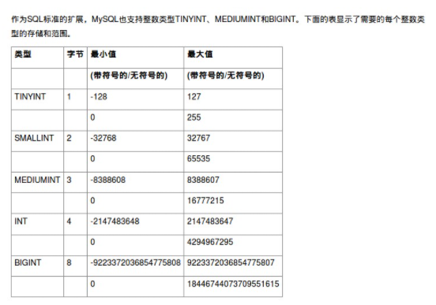

InnoDB引擎，增加事务处理（第26章）、并（第17章）、改
进全文本搜索（第18章）等的支持。  


对函数库、子查询（第14章）、集成帮助等的重要增加。
5——存储过程（第23章）、触发器（第25章）、游标（第24章）、
视图（第22章）等。  


# 联结


连表查询


# 多表查询

SELECT * FROM students, classes;

查询多张表的语法是：`SELECT * FROM <表1> <表2>` 


这种一次查询两个表的数据，查询的结果也是一个二维表，它是`students`表和`classes`表的“乘积”，即`students`表的每一行与`classes`表的每一行都两两拼在一起返回。结果集的列数是`students`表和`classes`表的列数之和，行数是`students`表和`classes`表的行数之积。


笛卡尔查询，使用笛卡尔查询时要非常小心，由于结果集是目标表的行数乘积。上述查询的结果集有两列`id`和两列`name`，两列`id`是因为其中一列是`students`表的`id`，而另一列是`classes`表的`id`，但是在结果集中，不好区分。两列`name`同理。

要解决这个问题，我们仍然可以利用投影查询的“设置列的别名”来给两个表各自的`id`和`name`列起别名：

```mysql
SELECT
    students.id sid,
    students.name,
    students.gender,
    students.score,
    classes.id cid,
    classes.name cname
FROM students, classes;
```


```mysql
SELECT
    s.id sid,
    s.name,
    s.gender,
    s.score,
    c.id cid,
    c.name cname
FROM students s, classes c;
```


```mysql
SELECT
    s.id sid,
    s.name,
    s.gender,
    s.score,
    c.id cid,
    c.name cname
FROM students s, classes c
WHERE s.gender = 'M' AND c.id = 1;
```

这个查询的结果集每行记录都满足条件`s.gender = 'M'`和`c.id = 1`。


# 连接查询


# 存数组


# 数据类型


## 整数类型

类型    占用字节

tinyint     1 从 0 到 255 的整型数据。存储大小为 1 字节。

smallint   2 从 -2^15 (-32,768) 到 2^15 – 1 (32,767) 的整型数据。存储大小为 2 个字节。 

mediumint 3

int        4 从 -2^31 (-2,147,483,648) 到 2^31 – 1 (2,147,483,647) 的整型数据（所有数字）。存储大小为 4 个字节。int 的 SQL-92 同义字为 integer。 

bigint     8 从 -2^63 (-9223372036854775808) 到 2^63-1 (9223372036854775807) 的整型数据（所有数字）。存储大小为 8 个字节。 

这是决定存储需要占用多少字节，那么后边的数字(M)代表什么

tinyint(M), M默认为4;

SMALLINT(M), M默认为6;
MEDIUMINT(M), M默认为9;
INT(M),M默认为11;
BIGINT(M),M默认为20.

M表示最大显示宽度, 建表若设置了zerofill(0填充), 会在数字前面补充0.



从 -2^63 (-9223372036854775808) 到 2^63-1 (9223372036854775807) 的整型数据（所有数字）。存储大小为 8 个字节。

　　大整数。带符号的范围是-9223372036854775808到9223372036854775807。无符号的范围是0到18446744073709551615。

　　注意：这里的M代表的并不是存储在数据库中的具体的长度，以前总是会误以为int(3)只能存储3个长度的数字，int(11)就会存储11个长度的数字，这是大错特错的。


mysql bigint(20)中20指的是该字段下能输入的最大数字长度。

括号里的数字叫数据的宽度，不同的数据类型对宽度的处理也不一样：
1、整数类型，这里显示的宽度和数据类型的取值范围是没有任何关系的，显示宽度只是指明Mysql最大可能显示的数字个数，数值的位数小于指定的宽度时会由空格填充；如果插入了大于显示宽度的值，只要该值不超过该类型的取值范围，数值依然可以插入，而且能够显示出来。例如上面的udi，显示的宽度是4，但是我向uid中插入100001，也是可以的，保存和显示的都会是100001；如果你不设置宽度，系统将添加默认的宽度tinyint(4),smallint(6),mediumint(9),int(11),bigint(20),这些默认的宽度是跟该类型的取值范围长度相关。
2、字符串类型，字符串类型这个宽度才真的用上了。不管是char还是varchar，宽度都定义了字符串的最大长度；例如上面的 password varchar(20),如果你输入了一个21个字符的密码，那么保存和显示的只会是前20个字符，你将丢失一个字符信息，char同理。由于varchar是变长存储的，所以实际开发中我们一般都把varchar的宽度设为最长255，反正你没用完它也不会浪费空间。
3、浮点和日期等数据类型对数据的宽度没有要求，一般也不设置，默认是0。


# 使用

请求连接的函数有几个，执行完毕处理连接的方式也不同：

1. db.Ping() 调用完毕后会马上把连接返回给连接池。
2. db.Exec() 调用完毕后会马上把连接返回给连接池，但是它返回的Result对象还保留这连接的引用，当后面的代码需要处理结果集的时候连接将会被重用。
3. db.Query() 调用完毕后会将连接传递给sql.Rows类型，当然后者迭代完毕或者显示的调用.Clonse()方法后，连接将会被释放回到连接池。
4. db.QueryRow()调用完毕后会将连接传递给sql.Row类型，当.Scan()方法调用之后把连接释放回到连接池。
5. db.Begin() 调用完毕后将连接传递给sql.Tx类型对象，当.Commit()或.Rollback()方法调用后释放连接。


## 查看操作日志


## 修改密码

在MySQL 8.04前，执行：SET PASSWORD=PASSWORD('[新密码]');但是MySQL8.0.4开始，这样默认是不行的。因为之前，MySQL的密码认证插件是“mysql_native_password”，而现在使用的是“caching_sha2_password”。

flush privileges;

ALTER USER 'root'@'localhost' IDENTIFIED WITH mysql_native_password BY '你的新密码' （新版本有用）


mysqladmin -u root -p password 104


grant all privileges on *.* to 'root'@'47.116.8.77' identified by '104' with grant option;

grant all privileges on *.* to 'root'@'localhost' identified by '104316aa' with grant option;

GRANT ALL PRIVILEGES ON *.* TO 'root'@'%' IDENTIFIED BY '104316aa' with grant option;

update user set host = '%' where user = 'root';

flush privileges;


service mysqld restart

select User,authentication_string,Host from user;


```
create user ``'brady'``@``'%'` `identified ``by` `'brady'``;
 GRANT ALL PRIVILEGES ON *.* TO 'brady'@'%';
 ALTER USER 'brady'@'%' IDENTIFIED WITH mysql_native_password BY 'brady';
 
 show global variables like 'port';
 shell> mysqladmin version
shell> mysqladmin variables
shell> mysqladmin -h `hostname` version variables
shell> mysqladmin -h `hostname` --port=3306 version
shell> mysqladmin -h host_ip version
shell> mysqladmin --protocol=SOCKET --socket=/tmp/mysql.sock version
```

```sql
SELECT CONCAT("'", user, "'@'", host, "'") FROM mysql.user;
select user, host from mysql.user;
```


## 连接异常问题

解决配置my.cnf到/etc/my.cnf中

show global variables like ‘port’;

SHOW VARIABLES LIKE ‘skip_networking’;

如果报告skip_networking = On，你的mysqld在没有网络支持的情况下启动（导致端口系统变量中的值为0）。

直接进入系统偏好-->mysql-->initialize Database，然后输出密码，重新初始化mysql或者配置中注释掉skip_networking。


## 登录

mysql -h 127.0.0.1 -u root -p -P 3306

mysql -h 120.79.169.139 -u admin -p -P 3306

show databases;

show tables;

desc tabl_name;

显示表结构，字段类型，主键，是否为空等属性，但不显示外键。

select * from information_schema.columns

where table_schema = 'db' #表所在数据库

and table_name = 'tablename' ; #你要查的表

查询表中列的注释信息


show create table user;

show create table user\G;

应该试验联结、并、子查询等，找出最佳的方法  

## SHOW STATUS

MySQL是用一系列的默认设置预先配置的，从这些设置开始通常是很好的。但过一段时间后你可能需要调整内存分配、缓冲区大小等。（为查看当前设置，可使用SHOW VARIABLES;和SHOWSTATUS;）  。

## SHOW PROCESSLIST

多用户多线程。遇到显著的性能不良，可使用SHOW PROCESSLIST显示所有活动进程（以及它们的线程ID和执行时间）  。KILL命令终结某个特定的进程（使用这个命令需要作为管理员登录）  


## 修改AUTO_INCREMENT起始值

可用alter table table_name AUTO_INCREMENT=n命令来重设自增的起始值


## 查版本

status;

select version();

mysql --help | grep Distrib

rpm -qa|grep mysql


## 更新参数

update warning_setting set sector_calcu_efficiency_frequency = 20 where pool_id=9


## 导出数据库

导出数据库：mysqldump -u 用户名 -p 数据库名 > 导出的文件名

mysqldump -u root -p news > news.sql  (输入后会让你输入进入MySQL的密码)

（如果导出单张表的话在数据库名后面输入表名即可）


## 导入数据库

输入命令"show databases；"，回车，看看有些什么数据库；建立你要还原的数据库，输入"create database voice；"，回车；切换到刚建立的数据库，输入"use voice；"，回车；导入数据，输入"source voice.sql；"，回车，开始导入，再次出现"mysql>"并且没有提示错误即还原成功。

mysql -u root -p voice<voice.sql，输入密码即可。


## 修改表中字段

```mysql
alter table device add has_hardware_config tinyint(1) unsigned zerofill default '1',
alter table device add has_software_config tinyint(1) unsigned zerofill default '1',

alter table device_hardware_check add swap_size int(1) unsigned NOT NULL,

alter table admin_warning_subscribe add sector_status tinyint(1) unsigned not NULL default '1',

alter table admin_warning_subscribe add device_offline tinyint(1) unsigned not NULL default '1',

alter table admin_warning_subscribe add ts_proof tinyint(1) unsigned not NULL default '1',

alter table admin_warning_subscribe add order_status tinyint(1) unsigned not NULL default '1',

alter table admin_warning_subscribe add miner_account tinyint(1) unsigned not NULL default '1',


alter table software_env_ready_list add need_force_disk_format tinyint(1) unsigned not NULL default '1',

alter table pool add token varchar(200) not NULL,

alter table software_env_ready_list change need_disk_format  need_disk_format  tinyint(1) unsigned not NULL default '1';

alter table software_env_ready_list change need_clean  need_clean  tinyint(1) unsigned not NULL default '1';

alter table software_env_ready_list change need_treed_file_ready  need_treed_file_ready  tinyint(1) unsigned not NULL default '1';

alter table software_env_ready_list change need_proof_param_file_ready  need_proof_param_file_ready  tinyint(1) unsigned not NULL default '1';

alter table software_env_ready_list change need_garbage_file_ready  need_garbage_file_ready  tinyint(1) unsigned not NULL default '1';


alter table admin_warning_notify change notify_end_time  notify_end_time  tinyint(1) unsigned not NULL;

alter table admin_warning_setting change balance_threshold  balance_threshold  int(1) unsigned not NULL;
alter table admin_warning_setting change compute_power_growth_threshold  compute_power_growth_threshold  int(1) unsigned not NULL;
```


alter table MyClass add passtest int(4) default '0';

加索引

alter table 表名 add index 索引名 (字段名1[，字段名2 …]);

alter table employee add index emp_name (name);

加主关键字的索引

alter table employee add primary key(id);

加唯一限制条件的索引

alter table 表名 add unique 索引名 (字段名);

alter table employee add unique emp_name2(cardnumber);

删除某个索引

alter table 表名 drop index 索引名;

alter table employee drop index emp_name;

增加字段

ALTER TABLE table_name ADD field_name field_type;

修改原字段名称及类型

ALTER TABLE table_name CHANGE old_field_name new_field_name field_type;

## 删除表中字段

ALTER TABLE table_name DROP field_name;


## 删除表

```
DROP TABLE table_name ;
```


## 清空表中数据

truncate table table_name;

delete * from table_name;

*delete from* 表名*;* 

*truncate table* 表名*;* 

## 改表名

```
ALTER  TABLE table_name RENAME TO new_table_name

alter table warning_info rename to admin_warning_info;
alter table warning_notify_setting rename to admin_warning_notify;
alter table warning_setting rename to admin_warning_setting;
alter table warning_subscribe rename to admin_warning_subscribe;
alter table admin_warning_info rename to admin_warning;

```


## 新建表

```mysql
Table: user
Create Table: CREATE TABLE `user` (
  `id` int(1) unsigned NOT NULL AUTO_INCREMENT,
  `cid` int(1) unsigned NOT NULL,
  `role_id` int(1) unsigned NOT NULL,
  `username` varchar(20) COLLATE utf8mb4_unicode_ci NOT NULL,
  `password` varchar(32) COLLATE utf8mb4_unicode_ci NOT NULL,
  `name` varchar(20) COLLATE utf8mb4_unicode_ci NOT NULL,
  `email` varchar(100) COLLATE utf8mb4_unicode_ci NOT NULL,
  `error_time` tinyint(1) unsigned NOT NULL,
  `last_login` datetime NOT NULL,
  `status` tinyint(1) unsigned NOT NULL DEFAULT '1',
  PRIMARY KEY (`id`),
  KEY `cid` (`cid`),
  KEY `username` (`username`)
) ENGINE=InnoDB AUTO_INCREMENT=12 DEFAULT CHARSET=utf8mb4 COLLATE=utf8mb4_unicode_ci
```

## device_hardware_check

id;device_id

root_directory_size; B

memory_size; G

//disk_size; B

//disk_num;

//disk_type;0=any 1=HDD 2=SSD

disk_check;//disk_size,disk_size,disk_type

gpu_name;

gpu_num;

//disk_size bigint(1) unsigned NOT NULL,

//disk_num int(1) unsigned NOT NULL,

//disk_type tinyint(1) unsigned NOT NULL DEFAULT '0',

```mysql
CREATE TABLE device_hardware_check (
  id int(1) unsigned NOT NULL,
  root_directory_size bigint(1) unsigned NOT NULL,
  memory_size int(1) unsigned NOT NULL,
  disk_check varchar(1024) COLLATE utf8mb4_unicode_ci NOT NULL,
  gpu_name varchar(128) COLLATE utf8mb4_unicode_ci NOT NULL,
  gpu_num tinyint(1) unsigned NOT NULL,
  PRIMARY KEY (id)
) ENGINE=InnoDB AUTO_INCREMENT=1 DEFAULT CHARSET=utf8mb4 COLLATE=utf8mb4_unicode_ci;

 swap_size int(1) unsigned NOT NULL,
```


AUTO_INCREMENT


## device_hardware_check_status

id

device_id

device_check_list_id

end_time

hard_check_status

root_directory_size_check_status

memory_size_check_status

disk_check_status

gpu_check_status

root_directory_size_result

memory_size_result

disk_check_result

gpu_check_result


```mysql
CREATE TABLE device_hardware_check_status (
  id int(1) unsigned NOT NULL AUTO_INCREMENT,
  device_id int(1) unsigned NOT NULL,
  device_check_list_id int(1) unsigned NOT NULL,
  hard_check_status tinyint(1) unsigned NOT NULL,
  root_directory_size_check_status tinyint(1) unsigned NOT NULL,
  memory_size_check_status tinyint(1) unsigned NOT NULL,
  disk_check_status tinyint(1) unsigned NOT NULL,
  gpu_check_status tinyint(1) unsigned NOT NULL,
  root_directory_size_result varchar(100) COLLATE utf8mb4_unicode_ci NOT NULL,
  memory_size_result varchar(100) COLLATE utf8mb4_unicode_ci NOT NULL,
  disk_check_result varchar(100) COLLATE utf8mb4_unicode_ci NOT NULL,
  gpu_check_result varchar(100) COLLATE utf8mb4_unicode_ci NOT NULL,
  end_time datetime NOT NULL,
  PRIMARY KEY (id),
  KEY device_id (device_id),
  KEY device_check_list_id (device_check_list_id)
) ENGINE=InnoDB AUTO_INCREMENT=1 DEFAULT CHARSET=utf8mb4 COLLATE=utf8mb4_unicode_ci;
```


## device_hardware_check_list

id

start_time

user_id

```mysql
CREATE TABLE device_hardware_check_list (
  id int(1) unsigned NOT NULL AUTO_INCREMENT,
  user_id int(1) unsigned NOT NULL,
  start_time datetime NOT NULL,
  PRIMARY KEY (id),
  KEY user_id (user_id)
) ENGINE=InnoDB AUTO_INCREMENT=1 DEFAULT CHARSET=utf8mb4 COLLATE=utf8mb4_unicode_ci;
```


## device_software_check


```mysql
CREATE TABLE device_software_check (
  id int(1) unsigned NOT NULL,
  root_dir_used_space int(1) unsigned NOT NULL,
  need_treed_file_check  tinyint(1) unsigned NOT NULL,
  need_garbage_file_check  tinyint(1) unsigned NOT NULL,
  need_proof_param_files_check  tinyint(1) unsigned NOT NULL,
  PRIMARY KEY (id)
) ENGINE=InnoDB AUTO_INCREMENT=1 DEFAULT CHARSET=utf8mb4 COLLATE=utf8mb4_unicode_ci;
```


## device_software_check_status


```mysql
CREATE TABLE device_software_check_status (
  id int(1) unsigned NOT NULL AUTO_INCREMENT,
  device_id int(1) unsigned NOT NULL,
  device_check_list_id int(1) unsigned NOT NULL,
  software_check_status tinyint(1) unsigned NOT NULL,
  root_dir_used_space_check_status tinyint(1) unsigned NOT NULL,
  treed_hash_check_status tinyint(1) unsigned NOT NULL,
  proof_param_files_check_status tinyint(1) unsigned NOT NULL,
  garbage_hash_check_status tinyint(1) unsigned NOT NULL,
  root_dir_used_space_result varchar(100) COLLATE utf8mb4_unicode_ci NOT NULL,
  treed_hash_result varchar(100) COLLATE utf8mb4_unicode_ci NOT NULL,
  proof_param_files_result varchar(100) COLLATE utf8mb4_unicode_ci NOT NULL,
  garbage_file_hash_result varchar(100) COLLATE utf8mb4_unicode_ci NOT NULL,
  end_time datetime NOT NULL,
  PRIMARY KEY (id),
  KEY device_id (device_id),
  KEY device_check_list_id (device_check_list_id)
) ENGINE=InnoDB AUTO_INCREMENT=1 DEFAULT CHARSET=utf8mb4 COLLATE=utf8mb4_unicode_ci;
```


## device_software_check_list


```mysql
CREATE TABLE device_software_check_list (
  id int(1) unsigned NOT NULL AUTO_INCREMENT,
  user_id int(1) unsigned NOT NULL,
  start_time datetime NOT NULL,
  PRIMARY KEY (id),
  KEY user_id (user_id)
) ENGINE=InnoDB AUTO_INCREMENT=1 DEFAULT CHARSET=utf8mb4 COLLATE=utf8mb4_unicode_ci;
```


## software_env_ready_status


```mysql
CREATE TABLE software_env_ready_status (
  id int(1) unsigned NOT NULL AUTO_INCREMENT,
  device_id int(1) unsigned NOT NULL,
  env_ready_list_id int(1) unsigned NOT NULL,  
  software_env_ready_status tinyint(1) unsigned NOT NULL,  
  end_time datetime NOT NULL,
  PRIMARY KEY (id),
  KEY device_id (device_id),
  KEY env_ready_list_id (env_ready_list_id)
) ENGINE=InnoDB AUTO_INCREMENT=1 DEFAULT CHARSET=utf8mb4 COLLATE=utf8mb4_unicode_ci;
```


## software_env_ready_list


```mysql
CREATE TABLE software_env_ready_list (
  id int(1) unsigned NOT NULL AUTO_INCREMENT,
  user_id int(1) unsigned NOT NULL,
  start_time datetime NOT NULL,
  need_disk_format  tinyint(1) unsigned NOT NULL,
  need_clean  tinyint(1) unsigned NOT NULL,
  need_proof_param_file_ready  tinyint(1) unsigned NOT NULL,
  need_treed_file_ready  tinyint(1) unsigned NOT NULL,
  need_garbage_file_ready  tinyint(1) unsigned NOT NULL,
  PRIMARY KEY (id),
  KEY user_id (user_id)
) ENGINE=InnoDB AUTO_INCREMENT=1 DEFAULT CHARSET=utf8mb4 COLLATE=utf8mb4_unicode_ci;
```

## param_filemanage

```mysql
CREATE TABLE param_filemanage (
  id int(1) unsigned NOT NULL AUTO_INCREMENT,
  md5 varchar(255) COLLATE utf8mb4_unicode_ci NOT NULL,
  local_path varchar(255) COLLATE utf8mb4_unicode_ci NOT NULL,
  download_url varchar(255) COLLATE utf8mb4_unicode_ci NOT NULL,
  name varchar(255) COLLATE utf8mb4_unicode_ci NOT NULL,
  file_type tinyint(1) unsigned NOT NULL,
  PRIMARY KEY (id)
) ENGINE=InnoDB AUTO_INCREMENT=1 DEFAULT CHARSET=utf8mb4 COLLATE=utf8mb4_unicode_ci;
```

  file_type ENUM('garbage','treed','param') NOT NULL,


## warning_subscribe

```mysql
CREATE TABLE warning_subscribe (
  id int(1) unsigned NOT NULL AUTO_INCREMENT,
  user_id int(1) unsigned NOT NULL,
  pool_id int(1) unsigned NOT NULL,
  //notify_start_time varchar(128) COLLATE utf8mb4_unicode_ci NOT NULL,
  //notify_end_time varchar(128) COLLATE utf8mb4_unicode_ci NOT NULL,
  //notify_by_mail tinyint(1) DEFAULT 1,
  //notify_by_calling tinyint(1) DEFAULT 1,
  sector_calcu_efficiency tinyint(1) DEFAULT 1,
  balance tinyint(1) DEFAULT 1,
  compute_power_growth tinyint(1) DEFAULT 1,
  block_height tinyint(1) DEFAULT 1,
  block_rate tinyint(1) DEFAULT 1,
  device_system_warning tinyint(1) DEFAULT 1,
  PRIMARY KEY (id)
) ENGINE=InnoDB AUTO_INCREMENT=1 DEFAULT CHARSET=utf8mb4 COLLATE=utf8mb4_unicode_ci;
```

## warning_notify_setting

```mysql
CREATE TABLE warning_notify_setting (
  user_id int(1) unsigned NOT NULL,
  notify_start_time varchar(128) COLLATE utf8mb4_unicode_ci NOT NULL,
  notify_end_time varchar(128) COLLATE utf8mb4_unicode_ci NOT NULL,
  notify_by_mail tinyint(1) DEFAULT 1,
  notify_by_calling tinyint(1) DEFAULT 1,
  PRIMARY KEY (user_id)
) ENGINE=InnoDB AUTO_INCREMENT=1 DEFAULT CHARSET=utf8mb4 COLLATE=utf8mb4_unicode_ci;
```


## warning_info

```mysql
CREATE TABLE warning_info (
  id int(1) unsigned NOT NULL AUTO_INCREMENT,
  user_id int(1) unsigned NOT NULL,
  pool_id int(1) unsigned NOT NULL,
  device_id int(1) unsigned NOT NULL,
  miner_type tinyint(1) unsigned NOT NULL,
  type int(1) unsigned NOT NULL,
  info varchar(1024) COLLATE utf8mb4_unicode_ci NOT NULL,
  add_time datetime NOT NULL,
  status tinyint(1) unsigned NOT NULL,
  PRIMARY KEY (id)
) ENGINE=InnoDB AUTO_INCREMENT=1 DEFAULT CHARSET=utf8mb4 COLLATE=utf8mb4_unicode_ci;
```


## warning_setting

```mysql
CREATE TABLE warning_setting (
  pool_id int(1) unsigned NOT NULL,
  sector_calcu_efficiency_threshold varchar(128) COLLATE utf8mb4_unicode_ci NOT NULL,
  balance_threshold varchar(128) COLLATE utf8mb4_unicode_ci NOT NULL,
  compute_power_growth_threshold varchar(128) COLLATE utf8mb4_unicode_ci NOT NULL,
  block_height_threshold varchar(128) COLLATE utf8mb4_unicode_ci NOT NULL,
  block_rate_threshold varchar(128) COLLATE utf8mb4_unicode_ci NOT NULL,
  sector_calcu_efficiency_frequency int(1) unsigned NOT NULL,
  balance_frequency int(1) unsigned NOT NULL,
  compute_power_growth_frequency int(1) unsigned NOT NULL,
  block_height_frequency int(1) unsigned NOT NULL,
  block_rate_frequency int(1) unsigned NOT NULL,
  device_warning_frequency int(1) unsigned NOT NULL,
  device_warning_type int(1) unsigned NOT NULL,
  PRIMARY KEY (pool_id)
) ENGINE=InnoDB AUTO_INCREMENT=1 DEFAULT CHARSET=utf8mb4 COLLATE=utf8mb4_unicode_ci;
```


mysql -h 120.79.169.139 -u admin -p


## app_device

```mysql
CREATE TABLE app_device (
	id INT(1) UNSIGNED NOT NULL AUTO_INCREMENT,
	app_id INT(1) UNSIGNED NOT NULL,
	cid INT(1) UNSIGNED NOT NULL,
	pool_id INT(1) UNSIGNED NOT NULL,
	device_id INT(1) UNSIGNED NOT NULL,
	status TINYINT(1) UNSIGNED NOT NULL,
	description VARCHAR(200) NOT NULL COLLATE utf8mb4_unicode_ci,
	PRIMARY KEY (id),
    KEY device_id (device_id)
) ENGINE=InnoDB COLLATE='utf8mb4_unicode_ci';
```


# mysql教程

http://c.biancheng.net/view/7201.html


https://github.com/jly8866/archer/blob/master/src/docs/mysql_db_design_guide.md 

# 参考

[sql参考使用](https://www.liaoxuefeng.com/wiki/1177760294764384/1179664013849760) 

[一个小时学会MySQL数据库](https://www.cnblogs.com/best/p/6517755.html) 


