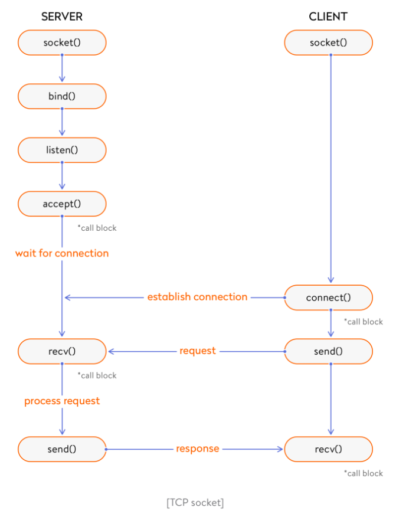
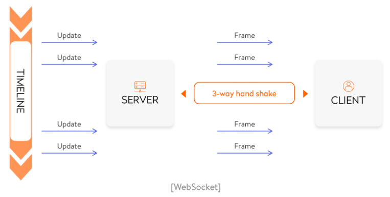
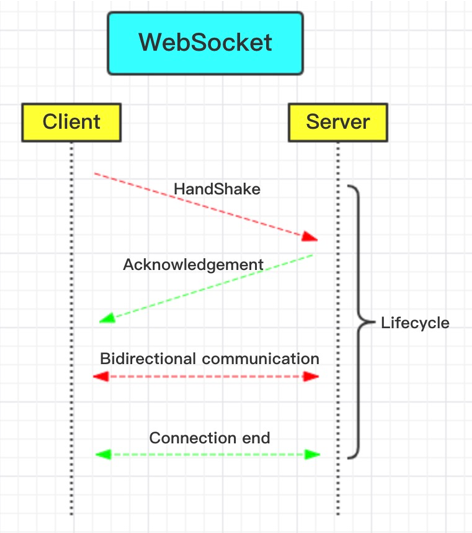
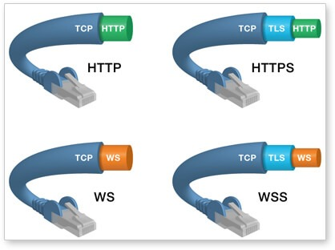

# 网络套接字


网络套接字有如下几种类型：

- 数据报套接字（SOCK_DGRAM），也称为无连接套接字，使用用户数据报协议（UDP）。数据报套接字支持双向消息流并保留记录边界。
- 流套接字（SOCK_STREAM），也称为面向连接的套接字，使用传输控制协议（TCP），流控制传输协议（SCTP）或数据报拥塞控制协议（DCCP）。这些套接字提供了没有记录边界的双向，可靠，有序且无重复的数据流。
- 原始套接字（或原始IP套接字）通常在路由器和其他网络设备中可用。这些套接字通常是面向数据报的，尽管它们的确切特性取决于协议提供的接口。大多数应用程序不使用原始套接字。提供它们是为了支持新的通信协议的开发，并提供对现有协议更深层设施的访问。

## tcp



## WebSocket



它使用HTTP协议进行初始握手。成功握手后，连接就建立起来了，并且WebSocket实质上使用原始TCP(raw tcp)来读取/写入数据。

客户端请求如下所示：

```
GET /chat HTTP/1.1
    Host: server.example.com
    Upgrade: websocket
    Connection: Upgrade
    Sec-WebSocket-Key: x3JJHMbDL1EzLkh9GBhXDw==
    Sec-WebSocket-Protocol: chat, superchat
    Sec-WebSocket-Version: 13
    Origin: http://example.com
```

这是服务器响应：

```
HTTP/1.1 101 Switching Protocols
    Upgrade: websocket
    Connection: Upgrade
    Sec-WebSocket-Accept: HSmrc0sMlYUkAGmm5OPpG2HaGWk=
    Sec-WebSocket-Protocol: chat
```

## Base Framing Protocol

```
0                   1                   2                   3
      0 1 2 3 4 5 6 7 8 9 0 1 2 3 4 5 6 7 8 9 0 1 2 3 4 5 6 7 8 9 0 1
     +-+-+-+-+-------+-+-------------+-------------------------------+
     |F|R|R|R| opcode|M| Payload len |    Extended payload length    |
     |I|S|S|S|  (4)  |A|     (7)     |             (16/64)           |
     |N|V|V|V|       |S|             |   (if payload len==126/127)   |
     | |1|2|3|       |K|             |                               |
     +-+-+-+-+-------+-+-------------+ - - - - - - - - - - - - - - - +
     |     Extended payload length continued, if payload len == 127  |
     + - - - - - - - - - - - - - - - +-------------------------------+
     |                               |Masking-key, if MASK set to 1  |
     +-------------------------------+-------------------------------+
     | Masking-key (continued)       |          Payload Data         |
     +-------------------------------- - - - - - - - - - - - - - - - +
     :                     Payload Data continued ...                :
     + - - - - - - - - - - - - - - - - - - - - - - - - - - - - - - - +
     |                     Payload Data continued ...                |
     +---------------------------------------------------------------+
```


# websocket介绍

## 需求

http协议是单向，这种单向请求的特点，注定了如果服务器有连续的状态变化，客户端要获知就非常麻烦。我们只能使用["轮询"](https://www.pubnub.com/blog/2014-12-01-http-long-polling/)：每隔一段时候，就发出一个询问，了解服务器有没有新的信息。最典型的场景就是聊天室。

轮询的效率低，非常浪费资源（因为必须不停连接，或者 HTTP 连接始终打开）。因此，工程师们一直在思考，有没有更好的方法。


我希望只查询一次航班动态，当航班有更新时，服务器可以主动把最新的航班动态信息推送给我！


- **轮询（如ajax的轮询）方式**

即程序内部在小铭第一次请求时，记录下这个请求信息和响应信息，每隔固定时间（例如1分钟）请求一次服务器，服务器返回当前最新状态，对比之前收到的信息，如果相比有变更，则通知小铭；

> 客户端：有没有新动态(Request)服务端：正常起飞（Response）客户端：啦啦啦，有没有新动态(Request)服务端：正常起飞。。（Response）


- **服务端增加延迟答复(长连接)**

即程序内部依然采用轮询方式，不过比上一个方案相比，采取了阻塞方式。（一直打电话，没收到就不挂电话），也就是说，客户端发起连接后，如果服务端没消息，就一直不返回Response给客户端。直到有消息才通知小铭，之后客户端再次建立连接，周而复始。

> 客户端：有没有新动态，没有的话就等有了才返回给我吧（Request）服务端：等到有动态的时候再告诉你。（过了一会儿）来了，给你，延误30分钟（Response）客户端：有没有新动态，没有的话就等有了才返回给我吧（Request）

**从整个交互的过程来看，这两种都是非常消耗资源的。**

- 第一种方案,即轮询，需要服务器有很快的处理速度和处理器资源。（训练有素的接线员）
- 第二种方案，即HTTP长连接（后文还会介绍），需要有很高的并发，也就是说并行处理的能力。（足够多的接线员）


所以它们都有可能发生下面这种情况：

> 客户端：有新动态么？服务端：问的人太多了，线路正忙，请稍后再试（503 Server Unavailable）客户端：。。。。好吧，有新动态么？服务端：问的人太多了，线路正忙，请稍后再试（503 Server Unavailable）


这两种http都不是最好方式

- **HTTP的被动性**：需要很多服务资源。一种需要“接线员”有更快的速度，一种需要更多的“接线员”。这两种都会导致对服务资源（接线员）的需求越来越高。
- **HTTP的无状态性**：由于接线员只管接电话和处理请求内容，并不会去记录是谁给他们打了电话，每次打电话，都要重新告诉一遍接线员你是谁和你的请求内容是什么。


## 由来

它的最大特点就是，服务器可以主动向客户端推送信息，客户端也可以主动向服务器发送信息，是真正的双向平等对话，属于[服务器推送技术](https://en.wikipedia.org/wiki/Push_technology)的一种。


使用了WebSocket以后，上面的场景会变成怎样的流程：

> 客户端：我要开始使用WebSocket协议，需要的服务：chat(查动态)，WebSocket协议版本：13（HTTP Request）服务端：没问题，已升级为WebSocket协议（HTTP Protocols Switched）客户端：麻烦航班动态有更新的时候推送通知给我。服务端：没问题。（……过了10分钟）服务端：有动态啦，延误30分钟！（……过了30分钟）服务端：有动态啦，现在开始登机！

由此可见，

- 当使用WebSocket时，服务端可以主动推送信息给客户端了，不必在意客户端等待了多久，不必担心超时断线，解决了被动性问题。
- Websocket只需要一次HTTP交互，来进行协议上的切换，整个通讯过程是建立在一次连接/状态中，也就避免了HTTP的无状态性，服务端会一直知道你的信息，直到你关闭请求，这样就解决了服务端要反复解析HTTP请求头的问题。




## 特点介绍

WebSocket是HTML5提出的一个协议规范（2011年）附上协议链接：

[The WebSocket Protocol RFC6455](https://www.rfc-editor.org/rfc/pdfrfc/rfc6455.txt.pdf)

WebSocket约定了一个通信的规范，通过一个握手的机制，客户端（如浏览器）和服务器（WebServer）之间能建立一个类似Tcp的连接，从而方便C-S之间的通信。


- 建立在 TCP 协议之上，它需要通过握手连接之后才能通信，服务器端的实现比较容易。
- 与 HTTP 协议有着良好的兼容性。默认端口也是80或443，并且握手阶段采用 HTTP 协议，因此握手时不容易屏蔽，能通过各种 HTTP 代理服务器。
- 数据格式比较轻量，性能开销小，通信高效。可以发送文本，也可以发送二进制数据。
- 没有同源限制，客户端可以与任意服务器通信。
- 协议标识符是ws（如果加密，则为wss），服务器网址就是URL。（例如：ws://www.example.com/chat）ws://example.com:80/some/path
- 它是一种双向通信协议，采用异步回调的方式接受消息，当建立通信连接，可以做到持久性的连接，WebSocket服务器和Browser都能主动的向对方发送或接收数据，实质的推送方式是服务器主动推送，只要有数据就推送到请求方。




TCP协议本身就实现了全双工通信，但是HTTP 协议的请求－应答机制限制了全双工通信。WebSocket连接建立以后，接下来的通信就不使用 HTTP 协议了，直接互相发数据。


```javascript
GET /chat HTTP/1.1
Host: server.example.com
Upgrade: websocket
Connection: Upgrade
Sec-WebSocket-Key: x3JJHMbDL1EzLkh9GBhXDw==
Sec-WebSocket-Protocol: chat, superchat
Sec-WebSocket-Version: 13
Origin: http://example.com
```

```javascript
pgrade: websocket
Connection: Upgrade
```

这个就是Websocket的核心了，告诉 `Apache` 、 `Nginx` 等服务器：注意啦，我发起的是Websocket协议，快点帮我找到对应的助理处理~不是那个老土的HTTP。

```javascript
Sec-WebSocket-Key: x3JJHMbDL1EzLkh9GBhXDw==
Sec-WebSocket-Protocol: chat, superchat
Sec-WebSocket-Version: 13
```

首先， `Sec-WebSocket-Key` 是一个 `Base64 encode` 的值，这个是浏览器随机生成的，告诉服务器：泥煤，不要忽悠窝，我要验证尼是不是真的是Websocket助理。

然后， `Sec_WebSocket-Protocol` 是一个用户定义的字符串，用来区分同URL下，不同的服务所需要的协议。简单理解：今晚我要服务A，别搞错啦~

最后， `Sec-WebSocket-Version` 是告诉服务器所使用的 `Websocket Draft`（协议版本），在最初的时候，Websocket协议还在 `Draft` 阶段，各种奇奇怪怪的协议都有，而且还有很多期奇奇怪怪不同的东西，什么Firefox和Chrome用的不是一个版本之类的，当初Websocket协议太多可是一个大难题。。不过现在还好，已经定下来啦~大家都使用的一个东西~ 脱水： 服务员，我要的是13岁的噢→_→

然后服务器会返回下列东西，表示已经接受到请求， 成功建立Websocket啦！

```javascript
HTTP/1.1 101 Switching Protocols
Upgrade: websocket
Connection: Upgrade
Sec-WebSocket-Accept: HSmrc0sMlYUkAGmm5OPpG2HaGWk=
Sec-WebSocket-Protocol: chat
```

这里开始就是HTTP最后负责的区域了，告诉客户，我已经成功切换协议啦~

```javascript
Upgrade: websocket
Connection: Upgrade
```

依然是固定的，告诉客户端即将升级的是 `Websocket` 协议，而不是mozillasocket，lurnarsocket或者shitsocket。

然后， `Sec-WebSocket-Accept` 这个则是经过服务器确认，并且加密过后的 `Sec-WebSocket-Key` 。 服务器：好啦好啦，知道啦，给你看我的ID CARD来证明行了吧。。

后面的， `Sec-WebSocket-Protocol` 则是表示最终使用的协议。


我们有一个非常快速的 `接线员（Nginx）` ，他负责把问题转交给相应的 `客服（Handler）` 。


# 原理哲学

## realTime

关于RealTime的实现，主要还是基于Ajax的拉取和Comet的推送。大家都知道Ajax，这是一种借助浏览器端JavaScript实现的异步无刷新请求功能：要客户端按需向服务器发出请求，并异步获取来自服务器的响应，然后按照逻辑更新当前页面的相应内容。但是这仅仅是**拉取**啊，这并不是真正的RealTime：缺少服务器端的自动推送！因此，我们不得不使用另一种略复杂的技术Comet，只有当这两者配合起来，这个web应用才勉强算是个RealTime应用！

随着HTML5草案的不断完善，越来越多的现代浏览器开始全面支持WebSocket技术了。

1. tcp上的全双工

2. WebSocket协议是借用HTTP协议的`101 switch protocol`来达到协议转换的，从HTTP协议切换成WebSocket通信协议。

再简单点来说，它就好像将Ajax和Comet技术的特点结合到了一起，只不过性能要高并且使用起来要方便的多（当然是之指在客户端方面。。）

这个协议是基于Frame而非Stream的，也就是说，数据的传输不是像传统的流式读写一样按字节发送，而是采用一帧一帧的Frame，并且每个Frame都定义了严格的数据结构，因此所有的信息就在这个Frame载体中。（后面会详细介绍这个Frame）

#### 特点

- 基于TCP协议
- 具有命名空间
- 可以和HTTP Server共享同一port


## 和TCP、HTTP协议的关系

WebSocket是基于TCP的独立的协议。
和HTTP的唯一关联就是HTTP服务器需要发送一个“Upgrade”请求，即`101 Switching Protocol`到HTTP服务器，然后由服务器进行协议转换。


# 实例

## 客户端示例

点击[这里](http://jsbin.com/muqamiqimu/edit?js,console)看运行结果

```javascript
var ws = new WebSocket("wss://echo.websocket.org");

ws.onopen = function(evt) { 
  console.log("Connection open ..."); 
  ws.send("Hello WebSockets!");
};

ws.onmessage = function(evt) {
  console.log( "Received Message: " + evt.data);
  ws.close();
};

ws.onclose = function(evt) {
  console.log("Connection closed.");
};     
```

```
"Connection open ..."
"Received Message: Hello WebSockets!"
"Connection closed."
```


## 客户端API

### WebSocket 构造函数

WebSocket 对象作为一个构造函数，用于新建 WebSocket 实例。

```javascript
var ws = new WebSocket('ws://localhost:8080');
```

执行上面语句之后，客户端就会与服务器进行连接。

实例对象的所有属性和方法清单，参见[这里](https://developer.mozilla.org/en-US/docs/Web/API/WebSocket)。

### webSocket.readyState

`readyState`属性返回实例对象的当前状态，共有四种。

```
CONNECTING：值为0，表示正在连接。
OPEN：值为1，表示连接成功，可以通信了。
CLOSING：值为2，表示连接正在关闭。
CLOSED：值为3，表示连接已经关闭，或者打开连接失败。
```

下面是一个示例

```javascript
switch (ws.readyState) {
  case WebSocket.CONNECTING:
    // do something
    break;
  case WebSocket.OPEN:
    // do something
    break;
  case WebSocket.CLOSING:
    // do something
    break;
  case WebSocket.CLOSED:
    // do something
    break;
  default:
    // this never happens
    break;
}
```

### webSocket.onopen

实例对象的`onopen`属性，用于指定连接成功后的回调函数。

```javascript
ws.onopen = function () {
  ws.send('Hello Server!');
}
```

如果要指定多个回调函数，可以使用`addEventListener`方法。

```javascript
ws.addEventListener('open', function (event) {
  ws.send('Hello Server!');
});
```

### webSocket.onclose

实例对象的`onclose`属性，用于指定连接关闭后的回调函数。

```javascript
ws.onclose = function(event) {
  var code = event.code;
  var reason = event.reason;
  var wasClean = event.wasClean;
  // handle close event
};

ws.addEventListener("close", function(event) {
  var code = event.code;
  var reason = event.reason;
  var wasClean = event.wasClean;
  // handle close event
});
```

### webSocket.onmessage

实例对象的`onmessage`属性，用于指定收到服务器数据后的回调函数。

```javascript
ws.onmessage = function(event) {
  var data = event.data;
  // 处理数据
};

ws.addEventListener("message", function(event) {
  var data = event.data;
  // 处理数据
});
```

注意，服务器数据可能是文本，也可能是二进制数据（`blob`对象或`Arraybuffer`对象）。

```javascript
ws.onmessage = function(event){
  if(typeof event.data === String) {
    console.log("Received data string");
  }

  if(event.data instanceof ArrayBuffer){
    var buffer = event.data;
    console.log("Received arraybuffer");
  }
}
```

除了动态判断收到的数据类型，也可以使用`binaryType`属性，显式指定收到的二进制数据类型。

```javascript
// 收到的是 blob 数据
ws.binaryType = "blob";
ws.onmessage = function(e) {
  console.log(e.data.size);
};

// 收到的是 ArrayBuffer 数据
ws.binaryType = "arraybuffer";
ws.onmessage = function(e) {
  console.log(e.data.byteLength);
};
```

### webSocket.send()

实例对象的`send()`方法用于向服务器发送数据。

发送文本的例子。

```javascript
ws.send('your message');
```

发送 Blob 对象的例子。

```javascript
var file = document
  .querySelector('input[type="file"]')
  .files[0];
ws.send(file);
```

发送 ArrayBuffer 对象的例子。

```javascript
// Sending canvas ImageData as ArrayBuffer
var img = canvas_context.getImageData(0, 0, 400, 320);
var binary = new Uint8Array(img.data.length);
for (var i = 0; i < img.data.length; i++) {
  binary[i] = img.data[i];
}
ws.send(binary.buffer);
```

### webSocket.bufferedAmount

实例对象的`bufferedAmount`属性，表示还有多少字节的二进制数据没有发送出去。它可以用来判断发送是否结束。

```javascript
var data = new ArrayBuffer(10000000);
socket.send(data);

if (socket.bufferedAmount === 0) {
  // 发送完毕
} else {
  // 发送还没结束
}
```

### webSocket.onerror

实例对象的`onerror`属性，用于指定报错时的回调函数。

```javascript
socket.onerror = function(event) {
  // handle error event
};

socket.addEventListener("error", function(event) {
  // handle error event
});
```


# 服务端的实现

WebSocket 服务器的实现，可以查看维基百科的[列表](https://en.wikipedia.org/wiki/Comparison_of_WebSocket_implementations)。

常用的 Node 实现有以下三种。

- [µWebSockets](https://github.com/uWebSockets/uWebSockets)
- [Socket.IO](http://socket.io/)
- [WebSocket-Node](https://github.com/theturtle32/WebSocket-Node)

具体的用法请查看它们的文档，这里不详细介绍了。


## WebSocketd

下面，我要推荐一款非常特别的 WebSocket 服务器：[Websocketd](http://websocketd.com/)。

它的最大特点，就是后台脚本不限语言，标准输入（stdin）就是 WebSocket 的输入，标准输出（stdout）就是 WebSocket 的输出。

举例来说，下面是一个 Bash 脚本`counter.sh`。

```bash
#!/bin/bash

echo 1
sleep 1

echo 2
sleep 1

echo 3
```

命令行下运行这个脚本，会输出1、2、3，每个值之间间隔1秒。

现在，启动`websocketd`，指定这个脚本作为服务。

```bash
$ websocketd --port=8080 bash ./counter.sh
```

上面的命令会启动一个 WebSocket 服务器，端口是`8080`。每当客户端连接这个服务器，就会执行`counter.sh`脚本，并将它的输出推送给客户端。

```javascript
var ws = new WebSocket('ws://localhost:8080/');

ws.onmessage = function(event) {
  console.log(event.data);
};
```

有了它，就可以很方便地将命令行的输出，发给浏览器。

> ```bash
> $ websocketd --port=8080 ls
> ```

上面的命令会执行`ls`命令，从而将当前目录的内容，发给浏览器。使用这种方式实时监控服务器，简直是轻而易举（[代码](https://github.com/joewalnes/web-vmstats)）。


更多的用法可以参考[官方示例](https://github.com/joewalnes/websocketd/tree/master/examples/bash)。

> - Bash 脚本[读取客户端输入](https://github.com/joewalnes/websocketd/blob/master/examples/bash/greeter.sh)的例子
> - 五行代码实现一个最简单的[聊天服务器](https://github.com/joewalnes/websocketd/blob/master/examples/bash/chat.sh) 


websocketd 的实质，就是命令行的 WebSocket 代理。只要命令行可以执行的程序，都可以通过它与浏览器进行 WebSocket 通信。下面是一个 Node 实现的回声服务[`greeter.js`](https://github.com/joewalnes/websocketd/blob/master/examples/nodejs/greeter.js)。

> ```javascript
> process.stdin.setEncoding('utf8');
> 
> process.stdin.on('readable', function() {
>   var chunk = process.stdin.read();
>   if (chunk !== null) {
>     process.stdout.write('data: ' + chunk);
>   }
> });
> ```

启动这个脚本的命令如下。

> ```bash
> $ websocketd --port=8080 node ./greeter.js
> ```

官方仓库还有其他[各种语言](https://github.com/joewalnes/websocketd/tree/master/examples)的例子。


# github.com/gorilla/websocket


# 运维系统websocket

## gateway总体

gateway-->worker

miner Gateway直接处理——//已登录的，心跳直接返回，其他转发消息

from：""				//GetClientType()登录

## gateway-server.go

gateway/srv/action/server.go

```go
type messageStruct struct {
    From     string		// device
    Reqtype  string		//post同步接口，write异步接口
    Act      string		//操作
    Act_id   string		//操作id，固件端生成，服务端收到什么回什么
    Client_id string	//主动上报时，这里为空，查询上报时，来什么回什么
    Act_code string		//操作ID，服务端生成，客户端收到什么回什么
}
=get_system_baseinfo
```

onConnect

onDisconnect

onMessage


### gateway自己处理


from：miner，device，html				//GetClientType()

act：操作，start，heartbeat

miner Gateway直接处理——//已登录的，心跳直接返回，其他转发消息

> from= miner //GetClientType()
>
> act:
>
> ​	get_miner_incomelist
>
> ​	get_miner_balance
>
> ​	get_miner_power
>
> ​	get_miner_height
>
> ​	get_miner_info

否则Gateway转发消息

### gateway转发给worker

ars.cloud.srv.worker

```go
rsp, err := microClient.Worker(context.Background(), &cc.Request{
    ServerName  : ServerName,	//gateway名字，可能有多个
    ClientType  : c.GetClientType(),
    ClientId    : c.GetClientId(),
    Message     : string(data),     
})
```


from：""				//GetClientType()登录


### worker-router

worker/srv/handler/route.go

### worker-device.go

-->worker/srv/handler/device.go

```
info := DevUpGetSystemBaseinfoStruct{}
    err := json.Unmarshal(data, &info)
```

### lib-common...cloud_device_up.go

struct--->hos/go-lib-common/socket_struct/cloud_device_up.go——矿机上行


### lib-common...cloud_device_down.go


```
from	"html"
act	"start"
act_code	"codeNew"
user_id	8
token	"ece75cbd23bcc805518b5988079f5583"

act	"return"
act_code	"codeNew"
action	"start"
hardware_id	""
code	0
description	"æ\u0093\u008dä½\u009cæ\u0088\u0090å\u008a\u009f"


from	"html"
act	"heartbeat"
act_code	"codeNew"

act	"return"
act_code	"codeNew"
action	"heartbeat"
hardware_id	""
code	0
description	"æ\u0093\u008dä½\u009cæ\u0088\u0090å\u008a\u009f"

act	"warning"
act_code	""
type	2
hardware_id	"billtest000000004"
name	"billtest000000004"
message	"Disk[/dev/sdl]硬ç\u009b\u0098æ\u008d\u009få\u009d\u008f"
```


# 参考

1. [WebSocket的故事（一）-- WebSocket的由来](https://juejin.im/post/6844903655221493774) 

2. [WebSocket 协议介绍及 WebSocket API 应用](https://juejin.im/entry/6844903604864679943) 

- [How to Use WebSockets](http://cjihrig.com/blog/how-to-use-websockets/)
- [WebSockets - Send & Receive Messages](https://www.tutorialspoint.com/websockets/websockets_send_receive_messages.htm)
- [Introducing WebSockets: Bringing Sockets to the Web](https://www.html5rocks.com/en/tutorials/websockets/basics/) 


[RFC参考](https://tools.ietf.org/html/rfc6455#section-5.2) 


