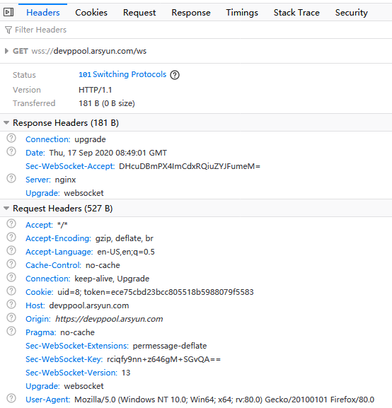

# 节点上行接口

## 1示例

```json
from	"html"
act	"start"
act_code	"codeNew"
user_id	8
token	"ece75cbd23bcc805518b5988079f5583"
```


```
{"from":"html","act":"start","act_code":"codeNew","user_id":8,"token":"ece75cbd23bcc805518b5988079f5583"}
```

### header



## 2.heartbeat

```json
from	"html"
act	"heartbeat"
act_code	"codeNew"
```


# 节点下行接口

## 1.

```json
act	"return"
act_code	"codeNew"
action	"start"
hardware_id	""
code	0
description	"æ\u0093\u008dä½\u009cæ\u0088\u0090å\u008a\u009f"
```


```
{"act":"return","act_code":"codeNew","action":"start","hardware_id":"","code":0,"description":"操作成功"}
```

## 2.

```json
act	"return"
act_code	"codeNew"
action	"heartbeat"
hardware_id	""
code	0
description	"æ\u0093\u008dä½\u009cæ\u0088\u0090å\u008a\u009f"
```

3.

```json
act	"warning"
act_code	""
type	2
hardware_id	"billtest000000004"
name	"billtest000000004"
message	"Disk[/dev/sdl]硬ç\u009b\u0098æ\u008d\u009få\u009d\u008f"
```


# 财务下行接口


# 财务上行接口


